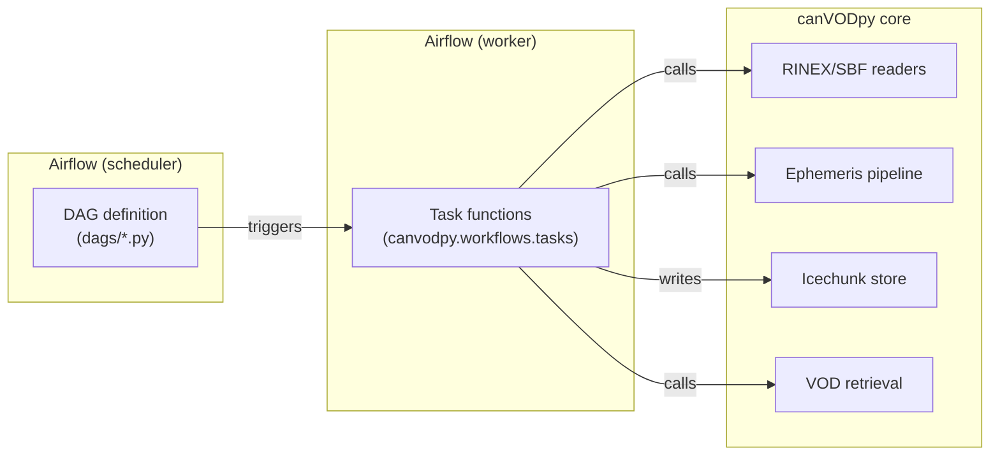
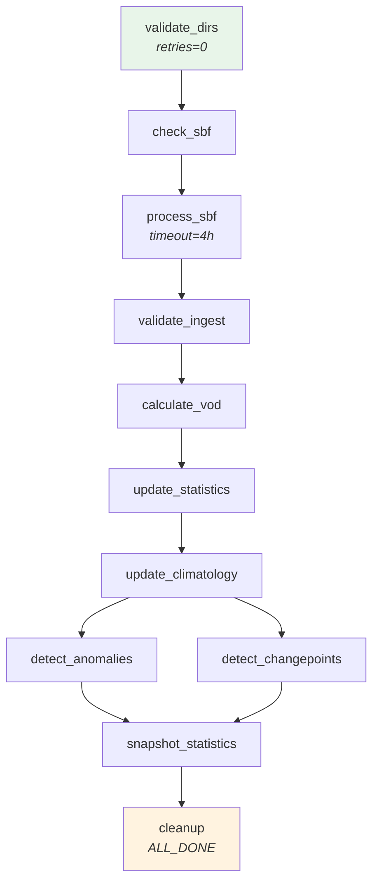
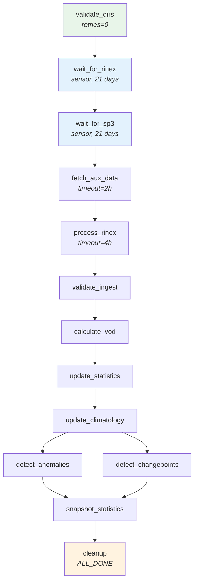
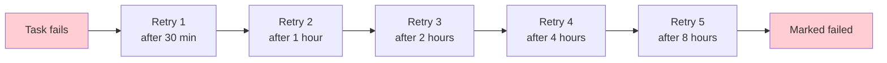

# Airflow Integration

canVODpy automates daily GNSS-T processing through Apache Airflow, an
open-source workflow orchestration platform. This guide covers the
pipeline architecture, task functions, deployment, and operation.

---

## What is Apache Airflow?

Apache Airflow is a platform for scheduling and monitoring computational
workflows. If you have never used Airflow before, the following concepts
are essential for understanding this guide.

### Core concepts

| Concept | What it means |
|---------|---------------|
| **DAG** | A Directed Acyclic Graph — a collection of tasks with defined execution order. Each DAG represents one pipeline. |
| **Task** | A single unit of work (e.g., "download SP3 files" or "compute VOD"). Tasks are Python functions. |
| **Operator** | The type of work a task performs. canVODpy uses the `@task` decorator (TaskFlow API), which wraps Python functions. |
| **Sensor** | A special task that waits for an external condition (e.g., "are SP3 files available on the FTP server?"). |
| **XCom** | Short for "cross-communication" — how tasks pass small data (dicts, strings) to downstream tasks. |
| **DAG Run** | A single execution of a DAG for a specific date. Each run is independent. |
| **Schedule** | How often a DAG runs. canVODpy DAGs run `@daily`. |
| **Retry** | When a task fails, Airflow automatically retries it after a delay. |
| **Catchup** | Whether Airflow runs missed past dates on startup. Disabled (`False`) for canVODpy — use the backfill DAG instead. |

### How Airflow fits into canVODpy



Airflow handles **when** and **in what order** tasks run. The task
functions are thin wrappers that call into existing canVODpy machinery —
the same code used by the Python API levels (L1–L4).

---

## Pipeline Architecture

canVODpy generates **two DAGs per research site** — one for each data
source and ephemeris strategy.

### Why two DAGs?

GNSS receivers produce two types of data with fundamentally different
availability timelines:

| Data source | Ephemeris | Availability | Accuracy |
|-------------|-----------|-------------|----------|
| **SBF** (Septentrio binary) | Broadcast (embedded in SBF) | Same-day | ~1–2 m satellite position |
| **RINEX** (ASCII observation) | Agency final (SP3/CLK from IGS) | 12–18 day delay | ~3 cm satellite position |

A single DAG would either block same-day results while waiting for
agency products, or show confusing "running for 18 days" status in the
UI. Separate DAGs provide independent failure domains and clean status
tracking.

### SBF DAG — same-day results



**`canvod_{site}_sbf`** processes SBF binary files using broadcast
ephemeris data embedded in the SBF `SatVisibility` blocks. No external
orbit products are needed — results are available the same day the
receiver transfers data.

### RINEX DAG — agency-quality, delayed



**`canvod_{site}_rinex`** waits for RINEX observation files and IGS
agency SP3/CLK orbit products to become available. The two sensor tasks
(blue) use Airflow's `mode='reschedule'` to free up worker slots while
waiting — the DAG run shows as "running" but consumes no resources.

If SP3 products are still unavailable after 30 days, the sensor
abandons the run (`AirflowSkipException`) to prevent permanent UI
clutter.

### Current deployment

| DAG ID | Site | Branch | Schedule |
|--------|------|--------|----------|
| `canvod_Rosalia_sbf` | Rosalia | SBF + broadcast | `@daily` |
| `canvod_Rosalia_rinex` | Rosalia | RINEX + agency | `@daily` |
| `canvod_Fair_sbf` | Fair | SBF + broadcast | `@daily` |
| `canvod_Fair_rinex` | Fair | RINEX + agency | `@daily` |

New sites are added by editing `sites.yaml` — DAGs are generated
automatically.

---

## Task Reference

All task functions live in `canvodpy.workflows.tasks`. They accept only
primitives (`str`, `dict`, `list`, `None`) and return JSON-serializable
dicts for Airflow XCom. Internally they delegate to existing canVODpy
libraries.

### Ingest tasks

#### `validate_dirs`

Pre-flight naming convention check. Verifies that all files in the
receiver directories match the canVOD naming convention and that no
temporal overlaps exist (e.g., a daily file alongside 15-minute files
for the same day). Runs with `retries=0` — naming failures require
human intervention, not automatic retry.

#### `check_rinex` / `check_sbf`

Verify that data files exist for all configured receivers on the target
date. Uses `FilenameMapper` for file discovery when naming configuration
is available (prevents duplicate ingest from daily + sub-daily files).
Falls back to raw glob patterns when naming config is absent.

```python
result = check_rinex(site="Rosalia", yyyydoy="2025001")
# {"site": "Rosalia", "yyyydoy": "2025001", "ready": True,
#  "receivers": {"canopy_01": {"has_files": True, "count": 96, ...}, ...}}
```

Raises `RuntimeError` if files are missing — Airflow retries with
exponential backoff.

#### `fetch_aux_data`

Downloads SP3 orbit and CLK clock products from IGS FTP servers,
Hermite-interpolates ephemeris and piecewise-linear-interpolates clocks
to match the RINEX sampling rate, writes to a temporary Zarr store.
Only used in the RINEX DAG.

!!! warning "FTP credentials"
    Downloads from NASA CDDIS require an Earthdata account email.
    Set `nasa_earthdata_acc_mail` in `config/processing.yaml`.
    Without it, the pipeline falls back to ESA/BKG mirrors.

#### `process_rinex`

Reads RINEX files, augments with satellite positions and clock offsets
from the aux Zarr store, computes spherical coordinates (ECEF to polar
angle + azimuth), and writes to the site's Icechunk GNSS data store.
Deduplication via `"File Hash"` makes re-runs safe.

#### `process_sbf`

Same as `process_rinex` but for SBF binary data. Uses broadcast
ephemeris from SBF `SatVisibility` blocks — no aux Zarr needed.
Also writes SBF metadata (`sbf_obs`: PVT, DOP, SatVisibility) to
the store.

### Quality gate

#### `validate_ingest`

Reads back ingested data from the Icechunk store and checks physical
plausibility before VOD computation:

| Check | Criterion | Catches |
|-------|-----------|---------|
| Non-empty | epochs > 0, SIDs > 0 | Missing data, failed writes |
| SNR range | 0–70 dB-Hz | Corrupt values, unit errors |
| Polar angle (θ) | 0 to π/2 rad | Coordinate transform bugs |
| Azimuth (φ) | 0 to 2π rad | Wrap-around errors |

Raises `RuntimeError` on failure, blocking VOD computation until the
issue is resolved.

### Analysis tasks

#### `calculate_vod`

Reads paired canopy and reference datasets from the store, computes
VOD via the Tau-Omega radiative transfer model for each configured
analysis pair, and writes results to the VOD store.

#### `update_statistics`

Feeds per-cell observations into streaming accumulators (Welford
moments, quantile sketches, histograms, EWMA, S4 scintillation).
These accumulators maintain running statistics without storing raw
data — suitable for years of daily updates.

#### `update_climatology`

Builds day-of-year × time-of-day climatology grids from the streaming
accumulators. These grids define the "normal" signal baseline for
each site, enabling anomaly detection.

#### `detect_anomalies` / `detect_changepoints`

Run in parallel after `update_climatology`:

- **detect_anomalies**: computes z-scores against the climatology
  baseline. Classifications: Normal, Mild, Moderate, Severe.
- **detect_changepoints**: runs Bayesian Online Changepoint Detection
  (BOCPD) on daily means. Detects abrupt shifts from equipment
  failure, branch fall, or canopy events.

#### `snapshot_statistics`

Verifies that all analysis stages completed for the current date and
records a pipeline completion marker in the statistics store.

### Cleanup

#### `cleanup`

Removes temporary files (aux Zarr stores) created during processing.
Uses `TriggerRule.ALL_DONE` — runs even if upstream tasks fail or
sensors skip, ensuring the workspace is clean for the next run.

---

## Backfill DAG

The daily DAGs run with `catchup=False` — missed days are not
automatically reprocessed. For historical reprocessing, use the
dedicated backfill DAG.

### Usage

Trigger via the Airflow UI or CLI:

```bash
airflow dags trigger canvod_backfill --conf '{
    "site": "Rosalia",
    "branch": "sbf",
    "start_date": "2025-001",
    "end_date": "2025-010"
}'
```

| Parameter | Type | Description |
|-----------|------|-------------|
| `site` | string | Site name from `sites.yaml` |
| `branch` | `"sbf"` or `"rinex"` | Processing branch |
| `start_date` | `YYYYDDD` | First date to process (inclusive) |
| `end_date` | `YYYYDDD` | Last date to process (inclusive) |

### Behaviour

- Processes dates **sequentially** to prevent concurrent Icechunk writes.
- Per-date error handling: a failure on one date does not stop the
  remaining dates.
- Idempotent: already-processed dates are skipped via store hash
  deduplication.
- Timeout: 72 hours (covers ~365 days at ~5 min/day with margin).

---

## Reliability Features

### Retry strategy



All tasks use **exponential backoff** (`retry_delay=30 min`,
`max_retry_delay=12 hours`, 5 retries). This handles both
short-lived failures (network glitches) and long-latency data
availability (SP3 products published days later).

### Execution timeouts

| Task | Timeout | Rationale |
|------|---------|-----------|
| Default | 2 hours | Prevents zombie tasks |
| `process_rinex` / `process_sbf` | 4 hours | Large SBF files can be slow |
| `fetch_aux_data` | 2 hours | FTP download + interpolation |
| Backfill date range | 72 hours | Covers year-long reprocessing |

### Failure callbacks

Every task failure triggers `_task_failure_callback`, which logs
the DAG ID, task ID, execution date, exception, and log URL.
Extend this function to send Slack or email notifications.

### Data integrity

| Guard | Mechanism |
|-------|-----------|
| **No concurrent writes** | `max_active_runs=1` per DAG |
| **No duplicate data** | File hash deduplication in Icechunk store |
| **No corrupt VOD** | `validate_ingest` quality gate between ingest and retrieval |
| **No stale temp files** | `cleanup` with `TriggerRule.ALL_DONE` |
| **No permanent sensor waits** | SP3 abandonment after 30 days |

### Idempotency

Every task is safe to re-run:

- **Ingest tasks**: file hash deduplication skips already-written data.
- **Statistics tasks**: epoch-range recording prevents double-counting.
- **Backfill**: hash dedup + range recording make re-runs no-ops for
  completed dates.

---

## Deployment

### Prerequisites

- Apache Airflow >= 2.4 (TaskFlow API support)
- canVODpy installed in the Airflow worker environment
- `config/sites.yaml` and `config/processing.yaml` accessible from workers

### Installation

```bash
# 1. Install canvodpy in the Airflow worker environment
uv pip install -e ./canvodpy

# 2. Link DAGs into Airflow's dags_folder
ln -s /path/to/canvodpy/dags /path/to/airflow/dags/canvod

# 3. Verify DAGs are parsed
airflow dags list | grep canvod
```

### Docker deployment

For reproducible deployments, use `uv sync --frozen` to lock
dependencies:

```dockerfile
FROM python:3.13-slim
COPY pyproject.toml uv.lock /app/
RUN pip install uv && cd /app && uv sync --frozen
COPY dags/ /opt/airflow/dags/
```

### Verify configuration

```bash
# Check sites are loaded
airflow dags list | grep canvod
# Expected: canvod_Rosalia_sbf, canvod_Rosalia_rinex, canvod_Fair_sbf, canvod_Fair_rinex

# Check for import errors
airflow dags errors
```

---

## Calling Tasks Without Airflow

Task functions are plain Python — no Airflow dependency required.
Use them directly for scripting, debugging, or notebook exploration:

```python
from canvodpy.workflows.tasks import (
    check_sbf, process_sbf, validate_ingest,
    calculate_vod, update_statistics,
)

# SBF pipeline for one day
sbf_info = check_sbf("Rosalia", "2025001")
process_sbf("Rosalia", "2025001", receiver_files=sbf_info["receivers"])
validate_ingest("Rosalia", "2025001")
calculate_vod("Rosalia", "2025001")
update_statistics("Rosalia", "2025001")
```

This is API Level 4 (Functional) — the same code Airflow executes,
without the scheduling layer.

---

## File Layout

```
dags/
  gnss_daily_processing.py     Two DAG templates (SBF + RINEX per site)
  gnss_backfill.py             Manual backfill DAG

canvodpy/src/canvodpy/workflows/
  __init__.py                  Re-exports task functions
  tasks.py                     14 task functions:
                                 check_rinex, check_sbf,
                                 validate_data_dirs,
                                 fetch_aux_data,
                                 process_rinex, process_sbf,
                                 validate_ingest,
                                 calculate_vod,
                                 update_statistics,
                                 update_climatology,
                                 detect_anomalies,
                                 detect_changepoints,
                                 snapshot_statistics,
                                 cleanup
```

---

## Design Decisions

<div class="grid cards" markdown>

-   :fontawesome-solid-code-branch: &nbsp; **Two DAGs per site**

    ---

    SBF (same-day) and RINEX (delayed) have fundamentally different
    availability timelines. Separate DAGs provide independent failure
    domains and clean UI status.

-   :fontawesome-solid-arrows-left-right: &nbsp; **Primitive-only XCom**

    ---

    All task parameters are `str`, `dict`, `list`, or `None`. No xarray
    objects or `Path` instances cross task boundaries. Scientific data
    flows through Icechunk, not XCom.

-   :fontawesome-solid-eye: &nbsp; **Sensor for SP3 availability**

    ---

    The `wait_for_sp3` sensor checks FTP availability without downloading.
    `mode='reschedule'` frees the worker slot while waiting. Heavy lifting
    (download + interpolation) happens in a separate `fetch_aux_data` task.

-   :fontawesome-solid-shield-halved: &nbsp; **Quality gate**

    ---

    `validate_ingest` checks stored data before VOD computation. Catches
    corrupt writes, coordinate bugs, or SID mismatches before they
    propagate into the science products.

-   :fontawesome-solid-rotate: &nbsp; **Idempotent everything**

    ---

    File hash dedup, epoch-range recording, and `TriggerRule.ALL_DONE`
    cleanup ensure any task can be safely re-run at any time.

-   :fontawesome-solid-puzzle-piece: &nbsp; **Shared analysis pipeline**

    ---

    Both SBF and RINEX DAGs share `_wire_analysis_pipeline()` — the
    VOD → statistics → anomaly chain is identical. No code duplication.

</div>
