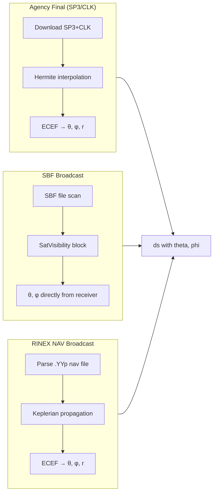
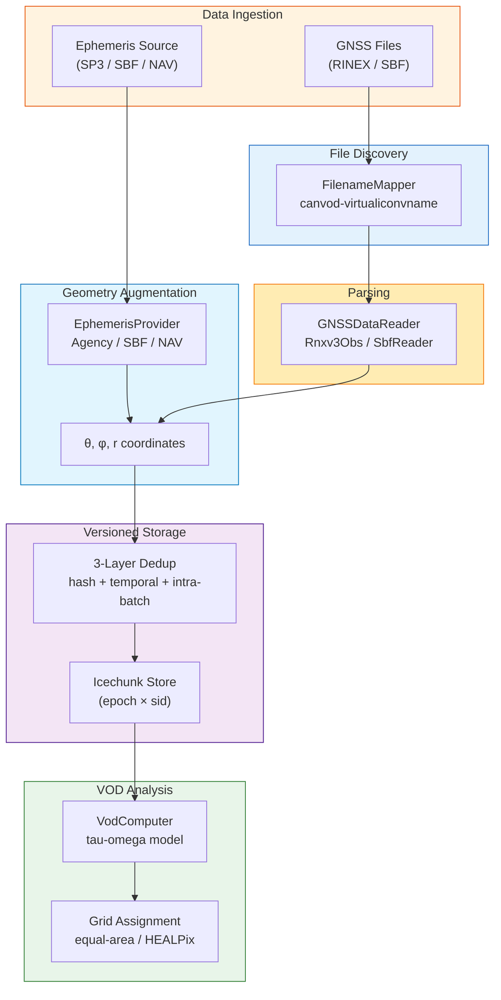

# API Levels

canvodpy exposes four API levels, each targeting a different use case. All levels
produce the same `(epoch, sid)` xarray Dataset format; they differ in how much
infrastructure they manage for you.

---

## Quick Comparison

| | L1: Convenience | L2: Fluent | L3: Site + Pipeline | L4: Functional |
|---|---|---|---|---|
| **Pattern** | `process_date(...)` | `.read().augment().result()` | `site.pipeline().process_date(...)` | `read_rinex(path)` |
| **Ephemeris** | Automatic (SP3/CLK) | `.augment(source=...)` | Automatic (SP3/CLK) | `augment_with_ephemeris(ds)` |
| **Store writes** | Automatic (Icechunk) | Optional `.to_store()` | Automatic (Icechunk) | None (NetCDF) |
| **File discovery** | FilenameMapper | FilenameMapper | FilenameMapper | Caller provides paths |
| **Dask parallelism** | Yes | No | Yes | No |
| **Deduplication** | 3-layer | None | 3-layer | None |
| **Best for** | Daily cron jobs | Interactive exploration | Multi-day batch runs | Airflow / custom pipelines |

---

## Level 1: Convenience Functions

One-liner entry points that handle everything internally.

```python
from canvodpy import process_date, calculate_vod

# Process one day: read → augment → write to store
process_date("Rosalia", "2025001")

# Compute VOD from stored data
calculate_vod("Rosalia", "canopy_01", "reference_01", "2025001")
```

Internally, `process_date()` creates a `Pipeline`, spawns Dask workers,
discovers files via `FilenameMapper`, downloads SP3/CLK ephemerides, runs
Hermite interpolation, computes theta/phi, writes to Icechunk with 3-layer
deduplication, and shuts down.

---

## Level 2: Fluent Workflow

Chainable deferred API for interactive use. Steps are recorded and executed
on a terminal call (`.result()`, `.to_store()`).

```python
import canvodpy

ds = (
    canvodpy.workflow("Rosalia")
    .read("2025001")
    .augment(source="final")     # SP3/CLK ephemeris
    .result()
)
```

=== "With broadcast ephemeris"

    ```python
    ds = (
        canvodpy.workflow("Rosalia")
        .read("2025001")
        .augment(source="broadcast")   # SBF SatVisibility or RINEX NAV
        .result()
    )
    ```

=== "With VOD"

    ```python
    vod_ds = (
        canvodpy.workflow("Rosalia")
        .read("2025001")
        .augment(source="final")
        .vod("canopy_01", "reference_01")
        .result()
    )
    ```

=== "Write to store"

    ```python
    (
        canvodpy.workflow("Rosalia")
        .read("2025001")
        .augment(source="final")
        .to_store()    # terminal: writes to Icechunk
    )
    ```

!!! info "Deferred execution"

    `.read()`, `.augment()`, `.vod()` do **not** execute immediately.
    They append to an internal plan. Execution happens on `.result()` or `.to_store()`.

---

## Level 3: Site + Pipeline

Object-oriented API for batch processing. Holds a Dask cluster across calls.

```python
from canvodpy import Site

site = Site("Rosalia")

with site.pipeline(n_workers=8) as pipeline:
    for date_key, datasets in pipeline.process_range("2025001", "2025007"):
        print(f"{date_key}: {sum(ds.sizes['epoch'] for ds in datasets.values())} epochs")

        # Optional: compute VOD inline
        site.vod.compute_day(datasets, "canopy_01_vs_reference_01")
```

Level 3 is functionally identical to Level 1 — the orchestrator runs the same
code path. The difference is ergonomic: Level 3 reuses the Dask cluster across
multiple `process_date()` calls, avoiding repeated cluster setup/teardown.

---

## Level 4: Functional API

Pure stateless functions for Airflow or custom pipelines. The caller provides
file paths and manages all orchestration.

```python
from canvodpy.functional import read_rinex, augment_with_ephemeris, calculate_vod

# Read a single file
ds = read_rinex("station.25o")

# Add satellite geometry (downloads SP3/CLK if needed)
ds = augment_with_ephemeris(ds, site_name="Rosalia", source="final")

# Compute VOD
vod_ds = calculate_vod(canopy_ds, reference_ds)
```

=== "Airflow-ready variants"

    ```python
    from canvodpy.functional import read_rinex_to_file, calculate_vod_to_file

    # Returns path string (XCom-serializable)
    obs_path = read_rinex_to_file("station.25o", output="obs.nc")
    vod_path = calculate_vod_to_file(canopy_path, ref_path, output="vod.nc")
    ```

=== "File discovery with FilenameMapper"

    ```python
    from canvod.virtualiconvname import FilenameMapper

    mapper = FilenameMapper(site="Rosalia", receiver="canopy_01")
    files = mapper.discover("2025001")

    datasets = [read_rinex(f) for f in files]
    ```

---

## Ephemeris Sources

All levels support three ephemeris sources for computing satellite geometry
(theta, phi). The source determines accuracy, latency, and internet requirements.

### Source comparison

| Source | Accuracy | Latency | Internet | Input files |
|--------|----------|---------|----------|-------------|
| **Agency final** (SP3/CLK) | ~2-3 cm orbit | 12-18 days | Required | SP3 + CLK from COD/ESA/IGS |
| **SBF broadcast** | ~1-2 m orbit | Immediate | None | SBF binary (SatVisibility block) |
| **RINEX NAV broadcast** | ~1-2 m orbit | Immediate | None | `.YYp` / `.YYn` nav files |

!!! tip "Accuracy perspective"

    A 2 m orbit error at 20,200 km altitude produces <0.00001 deg angular error
    in theta/phi — six orders of magnitude below GNSS measurement noise.
    For VOD applications, broadcast ephemerides are more than sufficient.

### How each source works



### Usage across levels

```python
# Level 1/3: config-driven (processing.yaml)
# ephemeris_source: "final" | "broadcast" | "auto"

# Level 2: explicit step
.augment(source="final")      # SP3/CLK
.augment(source="broadcast")  # SBF SatVisibility or RINEX NAV

# Level 4: explicit function
augment_with_ephemeris(ds, site_name="Rosalia", source="final")
augment_with_ephemeris(ds, site_name="Rosalia", source="broadcast")
```

### EphemerisProvider architecture

All three sources implement the same abstract interface:

```python
class EphemerisProvider(ABC):
    @abstractmethod
    def augment_dataset(self, ds, receiver_position) -> xr.Dataset:
        """Add theta, phi (and optionally r) to the observation dataset."""

    @abstractmethod
    def preprocess_day(self, date, site_config) -> Path | None:
        """Download/prepare ephemeris for a day. Returns cache path or None."""
```

| Provider | `preprocess_day()` | `augment_dataset()` |
|----------|-------------------|---------------------|
| `AgencyEphemerisProvider` | Downloads SP3/CLK, Hermite interpolation → Zarr cache | Opens Zarr, selects epochs, `compute_spherical_coordinates()` |
| `SbfBroadcastProvider` | No-op (geometry embedded in file) | Extracts theta/phi from `sbf_obs` auxiliary dataset |
| `RinexNavProvider` | Parses NAV file, Keplerian propagation → Zarr cache | Opens Zarr, selects epochs, `compute_spherical_coordinates()` |

---

## Data Flow Diagram



### What each level handles

| Step | L1 | L2 | L3 | L4 |
|------|:--:|:--:|:--:|:--:|
| File discovery | :fontawesome-solid-check: | :fontawesome-solid-check: | :fontawesome-solid-check: | caller |
| Reading | :fontawesome-solid-check: | :fontawesome-solid-check: | :fontawesome-solid-check: | :fontawesome-solid-check: |
| Ephemeris augmentation | auto | `.augment()` | auto | `augment_with_ephemeris()` |
| Deduplication | :fontawesome-solid-check: | — | :fontawesome-solid-check: | — |
| Store write | auto | `.to_store()` | auto | — |
| VOD computation | `calculate_vod()` | `.vod()` | `site.vod.compute_day()` | `calculate_vod()` |
| Dask parallelism | :fontawesome-solid-check: | — | :fontawesome-solid-check: | — |

---

## VOD Computation

VOD is computed via `VodComputer`, which offers two strategies:

=== "Daily (inline)"

    ```python
    # Compute VOD immediately after processing
    with site.pipeline() as pipeline:
        for date_key, datasets in pipeline.process_range("2025001", "2025007"):
            site.vod.compute_day(datasets, "canopy_01_vs_reference_01")
    ```

=== "Bulk (from store)"

    ```python
    # Recompute VOD for an entire time range from the RINEX store
    site.vod.compute_bulk(
        "canopy_01_vs_reference_01",
        start="2025001",
        end="2025031",
    )
    ```

Both strategies use the same core: rechunk → clear encodings → `VODFactory.create()` →
`calculator.calculate_vod()` → write to VOD store.

---

## Choosing the Right Level

??? question "I want to process data daily as a cron job"

    **Level 1** (`process_date`) or **Level 3** (`site.pipeline()`).
    Both handle everything: file discovery, ephemeris, store writes, dedup.
    Level 3 is better if you process multiple days in one run (reuses Dask cluster).

??? question "I want to explore data interactively in a notebook"

    **Level 2** (fluent workflow). Chain `.read().augment().result()` to get
    an in-memory Dataset without side effects. Add `.vod()` to compute VOD inline.

??? question "I want to integrate with Airflow"

    **Level 4** (functional). Use `*_to_file` variants that return path strings
    for XCom serialization. Each function is stateless and pure.

??? question "I want to read a single file quickly"

    **Level 4**: `read_rinex("file.rnx")` or use the reader directly:
    `SbfReader(fpath="file.sbf").to_ds()`.
