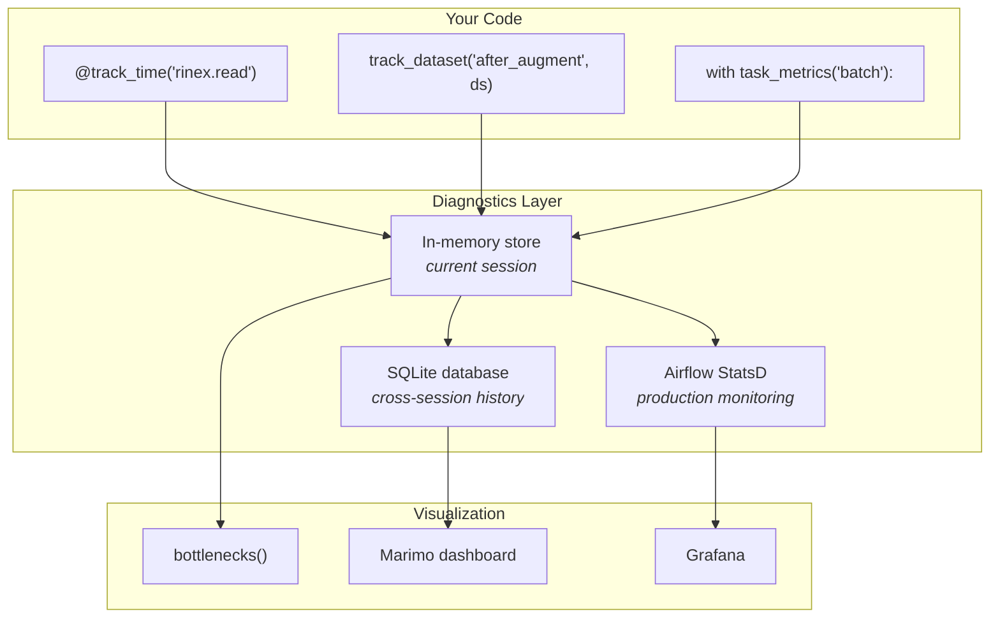

# Diagnostics & Performance Monitoring

Scientific computing pipelines often run for hours, processing hundreds of GNSS files per site per year. When something goes wrong — a step is unexpectedly slow, memory usage spikes, or data silently loses satellites — you need tools to find out *where* and *why*.

The `canvod.utils.diagnostics` module provides lightweight, zero-infrastructure monitoring that works on your laptop, in a Jupyter/marimo notebook, or inside Apache Airflow. No external services, no accounts, no Docker containers required.

---

## Why monitor a scientific pipeline?

If you have ever:

- Waited hours for a pipeline to finish, then wondered *which step* took so long
- Discovered that 50% of your SNR values are NaN, but only after plotting the final VOD
- Had a processing run silently skip files because of a transient download failure
- Wanted to compare "how fast did my pipeline run this week vs. last month?"

...then you need diagnostics. These tools answer those questions automatically, without changing how you write your science code.

---

## The three layers



| Layer | What | When to use |
|-------|------|-------------|
| **In-memory** | Polars DataFrame of all metrics from current Python session | Interactive exploration, notebooks |
| **SQLite** | Persistent database at `~/.canvod/metrics.db` | Compare runs across days/weeks, trend analysis |
| **Airflow StatsD** | Pushes to Prometheus/Grafana via Airflow's metrics system | Production monitoring with dashboards and alerts |

All three layers are populated automatically — you just decorate your functions.

---

## Quick start

### Install

The diagnostics module is part of `canvod-utils`, which is a dependency of every canvodpy package. No extra installation needed.

### Track how long something takes

```python
from canvod.utils.diagnostics import track_time

# As a decorator
@track_time("rinex.read")
def read_rinex(path):
    return reader.to_ds()

# As a context manager
with track_time("store.write", file="2025001.zarr") as t:
    ds.to_zarr(store)
print(f"Write took {t.elapsed:.1f}s")
```

Every call records a row: `operation`, `duration_s`, `timestamp`, plus any extra key-value pairs you pass.

### See where time goes

```python
from canvod.utils.diagnostics import bottlenecks

# After running your pipeline...
print(bottlenecks(top_n=5))
```

```
┌──────────────────┬─────────┬────────┬───────┬──────┐
│ operation        ┆ total_s ┆ mean_s ┆ count ┆ pct  │
├──────────────────┼─────────┼────────┼───────┼──────┤
│ store.write      ┆ 45.2    ┆ 4.5    ┆ 10    ┆ 38.1 │
│ rinex.read       ┆ 32.1    ┆ 3.2    ┆ 10    ┆ 27.0 │
│ aux.interpolate  ┆ 18.7    ┆ 1.9    ┆ 10    ┆ 15.7 │
│ vod.compute      ┆ 12.3    ┆ 1.2    ┆ 10    ┆ 10.4 │
│ coords.transform ┆ 10.5    ┆ 1.1    ┆ 10    ┆ 8.8  │
└──────────────────┴─────────┴────────┴───────┴──────┘
```

Now you know: optimize `store.write` first — it is 38% of total time.

---

## Tools reference

### `track_time` — Timing

Decorator **and** context manager. Records duration to the global metrics store.

```python
from canvod.utils.diagnostics import track_time

# Decorator: times every call to this function
@track_time("aux.download")
def download_orbits(date):
    ...

# Context manager: times a specific block
with track_time("pipeline.batch", site="rosalia", date="2025001"):
    process_batch(files)
```

**What it records:** `operation`, `duration_s`, `timestamp`, plus any keyword arguments you pass (e.g. `site`, `date`, `file`).

**When to use:** Wrap any function or code block you want to time. Use dot-separated names to create a hierarchy: `rinex.read`, `rinex.validate`, `store.write`, `store.commit`.

---

### `track_memory` — Peak memory

Same dual interface as `track_time`, but measures peak memory allocation using Python's built-in `tracemalloc`.

```python
from canvod.utils.diagnostics import track_memory

# Decorator
@track_memory("vod.compute")
def compute_vod(ds):
    ...

# Context manager
with track_memory("big_merge") as m:
    merged = xr.concat(datasets, dim="epoch")
print(f"Peak memory: {m.peak_mb:.0f} MB")
```

**What it records:** `operation`, `peak_memory_mb`, `current_memory_mb`, `metric_type="memory"`.

**When to use:** Wrap operations that handle large arrays — RINEX reads, dataset concatenations, VOD computations. Helps you find memory bottlenecks before you hit an `OutOfMemoryError`.

!!! warning "tracemalloc overhead"
    `tracemalloc` adds ~10-20% overhead. Use it during development and profiling, not in tight inner loops.

---

### `track_dataset` — Data quality

Inspects an xarray Dataset and records its shape, NaN ratios, epoch gaps, and size. This is the tool that catches silent data loss.

```python
from canvod.utils.diagnostics import track_dataset

ds = reader.to_ds()
report = track_dataset("after_read", ds)
# INFO: dataset_ok operation=after_read n_epochs=8640 n_sids=86 n_vars=4 size_mb=23.7

ds = augment_with_ephemeris(ds, sp3, clk)
report = track_dataset("after_augment", ds)
# WARNING: dataset_quality operation=after_augment n_epochs=8640 n_sids=86
#          high_nan_vars={'sat_x': 0.62} epoch_gaps=2
```

**What it checks:**

| Check | What it finds |
|-------|---------------|
| **Shape** | `n_epochs`, `n_sids` — did a merge drop satellites? |
| **NaN ratios** | Per-variable NaN percentage — did SP3 data fail to match? |
| **Epoch gaps** | Time series discontinuities >3x the median interval |
| **Size** | Dataset size in MB — sudden drops indicate data loss |

**The `DatasetReport` object:**

```python
report.n_epochs          # 8640
report.n_sids            # 86
report.nan_ratios        # {"sat_x": 0.62, "sat_y": 0.62, "SNR": 0.01}
report.epoch_gaps        # ["2025-01-01T06:00 → 2025-01-01T08:00 (gap=7200s, expected≈30s)"]
report.size_mb           # 23.7
report.as_dict()         # flat dict for Airflow XCom
```

**When to use:** After every processing step that transforms data. Place it after `read`, after `augment`, after `merge` — anywhere the dataset shape or content might change.

---

### `BatchTracker` — Batch processing

Tracks timing for a loop of sequential steps and produces a summary DataFrame and bar chart.

```python
from canvod.utils.diagnostics import BatchTracker

tracker = BatchTracker("process_2025")
for f in rinex_files:
    with tracker.step(f.name):
        process_file(f)

# Summary table
print(tracker.summary())

# Quick visualization
fig = tracker.plot()
fig.savefig("batch_timing.png")

# Aggregate stats
print(f"Total: {tracker.total:.1f}s, Mean: {tracker.mean:.1f}s/file")
```

**When to use:** Processing loops — iterating over files, dates, or sites.

---

### `task_metrics` — Airflow-ready monitoring

Context manager that combines timing + memory + success/failure tracking. Designed for Airflow tasks but works anywhere.

```python
from canvod.utils.diagnostics import task_metrics

# Standalone (no Airflow)
with task_metrics("ingest_rinex", site="rosalia") as m:
    process_all_files()
print(f"Took {m.duration_s:.1f}s, peak {m.peak_memory_mb:.0f} MB, status: {m.status}")

# Inside an Airflow task — push=True sends to XCom + StatsD
@task
def ingest_rinex(site, date, **context):
    with task_metrics("ingest_rinex", push=True, site=site, date=date) as m:
        process_files()
    return m.as_dict()  # available via XCom for downstream tasks
```

**What it collects:**

| Field | Description |
|-------|-------------|
| `duration_s` | Wall-clock time |
| `peak_memory_mb` | Peak memory via tracemalloc |
| `status` | `"success"` or `"failed"` (auto-detected from exceptions) |
| `extras` | Any keyword arguments you pass |

**What `push=True` does (Airflow only):**

1. Pushes `m.as_dict()` to **XCom** — downstream tasks can read it
2. Emits **StatsD** metrics: `canvod.<op>.duration_s`, `canvod.<op>.peak_memory_mb`, `canvod.<op>.success`

---

### `retry` — Retry with backoff

Wraps [tenacity](https://tenacity.readthedocs.io/) with a simple interface. Use for operations that fail transiently — network downloads, FTP connections.

```python
from canvod.utils.diagnostics import retry

@retry(attempts=3, delay=1.0, backoff=2.0, exceptions=(ConnectionError, TimeoutError))
def download_sp3(url):
    return fetch(url)
```

**Parameters:**

| Param | Default | Meaning |
|-------|---------|---------|
| `attempts` | 3 | Total tries before giving up |
| `delay` | 1.0 | Initial delay (seconds) between retries |
| `backoff` | 2.0 | Multiply delay by this after each retry (1s → 2s → 4s) |
| `exceptions` | `(Exception,)` | Only retry on these exception types |

---

### `rate_limit` — Throttle noisy callbacks

```python
from canvod.utils.diagnostics import rate_limit

@rate_limit(interval=2.0)
def log_progress(i, n):
    print(f"Processing {i}/{n}")

for i in range(100000):
    log_progress(i, 100000)  # prints at most every 2 seconds
```

---

### `timer` — Minimal stopwatch

For quick one-off timing without recording to the global store.

```python
from canvod.utils.diagnostics import timer

with timer() as t:
    ds = xr.open_dataset(path)
print(f"Read took {t['elapsed']:.2f}s")
```

---

### `bottlenecks` and `plot_bottlenecks` — Find what is slow

```python
from canvod.utils.diagnostics import bottlenecks, plot_bottlenecks

# Table: operation, total_s, mean_s, count, pct
df = bottlenecks(top_n=10)

# Horizontal bar chart with percentage labels
fig = plot_bottlenecks(top_n=8, title="Pipeline bottlenecks — Rosalia 2025")
fig.savefig("bottlenecks.png")
```

---

## Persistent metrics database

### How it works

Every `record()` call writes to both:

1. An **in-memory list** (fast, current session only)
2. A **SQLite database** (persistent, survives restarts)

The database is auto-created at `~/.canvod/metrics.db` on first use. Configure it explicitly:

```python
from canvod.utils.diagnostics import configure_db

# Custom path
configure_db("~/research/gnss_metrics.db")

# Disable persistence (in-memory only)
configure_db(None)
```

Or set the environment variable:

```bash
export CANVOD_METRICS_DB=~/research/gnss_metrics.db
# or disable:
export CANVOD_METRICS_DB=none
```

### Querying the database

```python
from canvod.utils.diagnostics import query_db

# All records from the last 24 hours
df = query_db(since="2026-03-09T00:00:00")

# Filter by operation pattern (SQL LIKE)
df = query_db(operation="store.%")

# Filter by metric type
df = query_db(metric_type="task")
df = query_db(metric_type="dataset")
df = query_db(metric_type="memory")

# Combine filters
df = query_db(since="2026-03-01", operation="rinex.%", limit=1000)
```

### Database schema

The `metrics` table stores all diagnostics in a single, queryable table:

| Column | Type | Source |
|--------|------|--------|
| `operation` | TEXT | All tools |
| `duration_s` | REAL | `track_time`, `task_metrics` |
| `timestamp` | TEXT (ISO 8601) | All tools |
| `metric_type` | TEXT | `"memory"`, `"dataset"`, `"task"`, or NULL (timing) |
| `status` | TEXT | `task_metrics` (`"success"` / `"failed"`) |
| `peak_memory_mb` | REAL | `track_memory`, `task_metrics` |
| `n_epochs` | INTEGER | `track_dataset` |
| `n_sids` | INTEGER | `track_dataset` |
| `n_variables` | INTEGER | `track_dataset` |
| `size_mb` | REAL | `track_dataset` |
| `batch` | TEXT | `BatchTracker` |
| `extras` | TEXT (JSON) | Any additional keyword arguments |

---

## Marimo dashboard

A pre-built interactive dashboard is included at `demo/diagnostics_dashboard.py`:

```bash
uv run marimo run demo/diagnostics_dashboard.py
```

It reads from the SQLite database and shows:

- **Summary cards** — total records, unique operations, total time, peak memory
- **Bottleneck chart** — interactive bar chart of slowest operations
- **Performance timeline** — how duration changes over time
- **Memory usage** — peak memory per operation
- **Dataset quality** — epoch/sid counts, NaN warnings, gap detection
- **Task outcomes** — success/failure donut chart
- **Raw data browser** — paginated table of all metrics

Filters: time range (1h / 24h / 7d / 30d / all) and metric type.

---

## Airflow + Grafana (production)

For production Airflow deployments, diagnostics metrics flow to Grafana via StatsD:

```
Pipeline task → task_metrics(push=True) → Airflow StatsD → Prometheus → Grafana
```

### Setup

1. **Enable StatsD in Airflow** (`airflow.cfg`):

    ```ini
    [metrics]
    statsd_on = True
    statsd_host = localhost
    statsd_port = 8125
    statsd_prefix = airflow
    ```

2. **Use `task_metrics` with `push=True`** in your DAG tasks:

    ```python
    @task
    def ingest_rinex(site: str, date: str, **context):
        with task_metrics("ingest_rinex", push=True, site=site, date=date):
            process_files()
    ```

3. **Import the Grafana dashboard**:

    The file `canvod/utils/diagnostics/grafana_dashboard.json` provides a
    pre-built dashboard with:

    - Task success rate gauge
    - Duration time series (per operation)
    - Memory usage bars
    - p50/p95 duration percentiles
    - Throughput (tasks/hour)
    - Success vs. failure pie chart

    Import it via Grafana UI → Dashboards → Import → Upload JSON.

---

## Patterns for scientific pipelines

### Pattern 1: Instrument every processing step

```python
from canvod.utils.diagnostics import track_time, track_dataset

@track_time("rinex.read")
def read_rinex(path):
    ds = reader.to_ds()
    track_dataset("after_read", ds, file=path.name)
    return ds

@track_time("aux.augment")
def augment(ds, sp3, clk):
    ds = augment_with_ephemeris(ds, sp3, clk)
    track_dataset("after_augment", ds)
    return ds

@track_time("store.write")
def write_store(ds, store, group):
    ds.to_zarr(store, group=group, mode="a")
```

### Pattern 2: Batch processing with summary

```python
from canvod.utils.diagnostics import BatchTracker, task_metrics

with task_metrics("daily_ingest", push=True, site="rosalia") as m:
    tracker = BatchTracker("files")
    for f in rinex_files:
        with tracker.step(f.name):
            ds = read_rinex(f)
            ds = augment(ds, sp3, clk)
            write_store(ds, store, group)

    print(tracker.summary())
    # Total: 142.3s for 24 files, mean 5.9s/file
```

### Pattern 3: Compare performance across runs

```python
from canvod.utils.diagnostics import query_db

# How did last week compare to this week?
last_week = query_db(since="2026-03-03", operation="rinex.read")
this_week = query_db(since="2026-03-10", operation="rinex.read")

print(f"Last week mean: {last_week['duration_s'].mean():.2f}s")
print(f"This week mean: {this_week['duration_s'].mean():.2f}s")
```

### Pattern 4: Memory-aware chunking decisions

```python
from canvod.utils.diagnostics import track_memory

# Compare chunking strategies
for chunk_size in [1000, 5000, 10000]:
    with track_memory(f"zarr.write.chunk_{chunk_size}") as m:
        ds.chunk({"epoch": chunk_size}).to_zarr(store)
    print(f"Chunk {chunk_size}: {m.peak_mb:.0f} MB")
```

---

## Summary

| Tool | One-liner | Use for |
|------|-----------|---------|
| `track_time` | How long did it take? | Every processing step |
| `track_memory` | How much RAM did it use? | Large array operations |
| `track_dataset` | Is the data still healthy? | After every transform |
| `BatchTracker` | How long did each file take? | Processing loops |
| `task_metrics` | Full task report (time + memory + status) | Airflow tasks |
| `retry` | Try again on failure | Network downloads |
| `rate_limit` | Don't log too often | Progress callbacks |
| `timer` | Quick stopwatch | One-off timing |
| `bottlenecks` | What is slowest? | Post-run analysis |
| `query_db` | What happened last week? | Cross-session trends |
