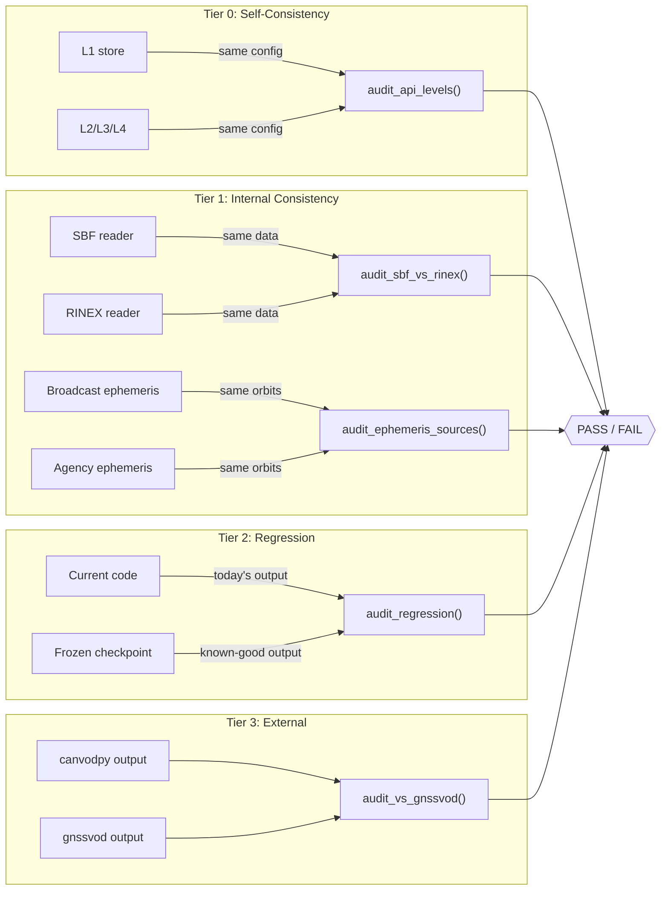

# canvod-audit

**Audit, comparison, and regression verification for canvodpy GNSS-VOD pipelines.**

`canvod-audit` is a workspace package that provides a structured, scientifically rigorous framework for verifying that canvodpy produces correct results. It exists because **tests alone are not enough** for a scientific processing pipeline: unit tests verify code logic, but audits verify that the *physical outputs* are right.

---

## Why this package exists

canvodpy is a scientific data processing pipeline. A subtle coordinate transformation bug, a sign flip in an angle, or a quiet change in NaN handling can produce outputs that look fine but are scientifically wrong.

Traditional software testing catches many of these issues, but not all:

- **Tests operate on tiny synthetic data.** A test with 10 epochs and 3 satellites cannot reveal a memory-layout bug that only manifests at 86,400 epochs and 321 satellites.
- **Tests don't cross implementation boundaries.** A unit test for canvodpy's VOD retrieval cannot tell you whether it agrees with a completely independent implementation of the same algorithm.
- **Tests don't survive refactors.** When you rewrite the RINEX reader, how do you prove the new version produces the *same* outputs as the old one?
- **Tests don't document tolerances.** Even when two outputs *should* differ (SBF quantizes SNR to 0.25 dB; RINEX to ~0.001 dB), you need to state and justify the expected difference.

---

## Four tiers + infrastructure



| Tier | What it answers | When to run |
|------|----------------|-------------|
| **Tier 0: Self-consistency** | Do all API levels produce identical output? | After any algorithm or API change |
| **Tier 1: Internal consistency** | Do different code paths through canvodpy agree? | After changing readers, ephemeris providers, or coordinate transforms |
| **Tier 2: Regression** | Did a code change alter the outputs? | After any code change (CI) |
| **Tier 3: External** | Does canvodpy agree with independent implementations? | Before publication, after major algorithm changes |
| **Infrastructure** | Is the pipeline deterministic, serialization-safe, and chunk-invariant? | After store/pipeline changes |

---

## Core concepts

### Tolerance tiers

Three strictness levels formalise how close "close enough" is:

| Tier | Tolerances | Use case |
|------|-----------|----------|
| **EXACT** | `atol=0, rtol=0` | Self-comparison, same code path |
| **NUMERICAL** | `atol=1e-12, rtol=1e-10` | Same algorithm, different float ordering |
| **SCIENTIFIC** | Per-variable, physically justified | Cross-implementation, different data sources |

SCIENTIFIC tolerances must include a `description` justifying the value:

```python
Tolerance(
    atol=0.25, rtol=0.0, nan_rate_atol=0.01,
    description="SBF firmware quantises SNR to 0.25 dB steps",
)
```

### NaN handling

GNSS data is full of NaNs (satellites below horizon, tracking loss). `canvod-audit` tracks NaN patterns explicitly:

- **`nan_agreement_rate`** — fraction where both arrays agree on NaN status
- **`nan_rate_atol`** — maximum allowed NaN rate difference
- All statistics computed only over mutually non-NaN elements

### Dataset alignment

`compare_datasets()` automatically finds the intersection of `epoch` and `sid` coordinates, aligns both datasets, and reports what was dropped in `AlignmentInfo`.

---

## Runners

### Tier 0: Self-consistency

```python
from canvod.audit.runners import audit_api_levels

result = audit_api_levels(
    stores={"l1": "/path/to/l1", "l2": "/path/to/l2"},
    reference_level="l1",
    store_type="rinex",
)
```

### Tier 1: Internal consistency

!!! warning "Extending the audit is mandatory"

    Adding a new reader, ephemeris source, or processing path is **not complete**
    until a corresponding Tier 1 audit runner exists. Every new code path must be
    cross-validated against at least one existing path on shared test data.

```python
from canvod.audit.runners import audit_sbf_vs_rinex, audit_ephemeris_sources

r1a = audit_sbf_vs_rinex(sbf_store="stores/sbf", rinex_store="stores/rinex")
r1b = audit_ephemeris_sources(broadcast_store="stores/broadcast", agency_store="stores/agency")
```

### Tier 2: Regression

Freeze a known-good output as a checkpoint, then compare future outputs against it:

=== "Create checkpoint"

    ```python
    from canvod.audit.runners import freeze_checkpoint

    freeze_checkpoint(
        store="/path/to/store",
        group="canopy_01",
        output_dir="/path/to/checkpoints",
        version="0.3.0",
        metadata={"git_hash": "abc123", "date": "2026-03-10"},
    )
    ```

=== "Verify against checkpoint"

    ```python
    from canvod.audit.runners import audit_regression

    result = audit_regression(store="/path/to/store", checkpoint_dir="checkpoints/")
    assert result.passed, result.summary()
    ```

### Tier 3: External intercomparison

Compares canvodpy against an independent implementation (e.g. gnssvod by Humphrey et al.).

**The SID vs PRN problem:** canvodpy uses SIDs (`G01|L1|C`), gnssvod uses PRNs (`G01`). Solution: trim the RINEX file to one code per band before processing both tools.

```python
from canvod.audit.rinex_trimmer import RinexTrimmer, gps_galileo_l1_l2

# Trim to one code per band (requires gfzrnx on PATH)
trimmer = RinexTrimmer(rinex_path, obs_types=gps_galileo_l1_l2())
trimmed_path = trimmer.write("/path/to/output/")

# Run comparison
from canvod.audit.runners import audit_vs_gnssvod

result = audit_vs_gnssvod(
    canvodpy_store="/path/to/canvodpy_store",
    gnssvod_file="/path/to/gnssvod_output.csv",
    group="canopy_01",
)
```

### Infrastructure checks

```python
from canvod.audit.runners import (
    audit_store_round_trip,
    audit_temporal_chunking,
    audit_idempotency,
    audit_constellation_filter,
)

audit_store_round_trip(store="stores/canvodpy")
audit_temporal_chunking(monolithic_store="stores/7days", chunked_store="stores/chunked")
audit_idempotency(run1_store="stores/run1", run2_store="stores/run2")
audit_constellation_filter(all_constellations_store="stores/all", filtered_store="stores/gps", system_prefix="G")
```

---

## Core API

### `compare_datasets()`

```python
from canvod.audit import compare_datasets, ToleranceTier, Tolerance

result = compare_datasets(
    ds_a, ds_b,
    variables=["SNR", "vod"],
    tier=ToleranceTier.SCIENTIFIC,
    tolerance_overrides={"SNR": Tolerance(atol=0.5, rtol=0.0)},
    label="canvodpy vs gnssvod",
)
```

**Returns** `ComparisonResult` with:

| Attribute | Description |
|-----------|-------------|
| `.passed` | `True` if all variables within tolerance |
| `.failures` | `dict[str, str]` — variable → failure reason |
| `.variable_stats` | `dict[str, VariableStats]` — per-variable statistics |
| `.alignment` | `AlignmentInfo` — what was kept/dropped |
| `.summary()` | Human-readable summary |
| `.to_polars()` | Polars DataFrame of per-variable stats |

### `VariableStats`

| Statistic | Description |
|-----------|-------------|
| `rmse` | Root mean square error |
| `bias` | Mean difference (a - b) |
| `mae` | Mean absolute error |
| `max_abs_diff` | Worst-case disagreement |
| `correlation` | Pearson correlation |
| `nan_agreement_rate` | NaN pattern consistency |
| `n_compared` | Effective sample size |

### Reporting

```python
from canvod.audit.reporting.tables import to_polars, to_markdown, to_latex
from canvod.audit.reporting.figures import plot_diff_histogram, plot_scatter, plot_summary_dashboard

# Tables
print(to_markdown(result))
print(to_latex(result, caption="SBF vs RINEX", label="tab:sbf-rinex"))

# Figures
fig = plot_summary_dashboard(result)
```

---

## Extending the audit framework

### Adding a new runner

1. Create a function in `canvod.audit.runners` following the pattern:

    ```python
    def audit_my_comparison(store_a: str, store_b: str, **kwargs) -> ComparisonResult:
        ds_a = load_from_store(store_a)
        ds_b = load_from_store(store_b)
        return compare_datasets(ds_a, ds_b, tier=ToleranceTier.SCIENTIFIC, ...)
    ```

2. Define SCIENTIFIC tolerances with justified `description` fields
3. Add integration tests in `packages/canvod-audit/tests/`
4. Document the runner's purpose and expected results

### Adding a new tolerance

When a new variable or comparison type needs custom tolerances:

```python
from canvod.audit.tolerances import Tolerance

MY_TOLERANCES = {
    "new_variable": Tolerance(
        atol=0.01, rtol=1e-6, nan_rate_atol=0.05,
        description="Justified by: [physical reason]",
    ),
}
```

### CI integration

```python
# tests/test_regression.py
import pytest
from canvod.audit.runners import audit_regression

@pytest.mark.integration
def test_regression(store_path, checkpoint_dir):
    result = audit_regression(store=store_path, checkpoint_dir=checkpoint_dir)
    assert result.passed, result.summary()
```

---

## Design decisions

| Decision | Rationale |
|----------|-----------|
| Separate workspace package | Audit code must not import from the package it audits (beyond xarray). Keeps core lean. |
| Frozen dataclasses for results | Immutable records, hashable, prevents accidental mutation |
| Polars for output tables | Consistent with canvodpy stack |
| `Tolerance.description` field | Every tolerance must be physically justified — extractable for methods sections |
| Four tiers | Maps directly to increasing levels of confidence: self → internal → regression → external |

---

**Next in the trail:** [Architecture](../../architecture.md) · [API Levels](../../guides/api-levels.md) · [AI Development](../../guides/ai-development.md)
