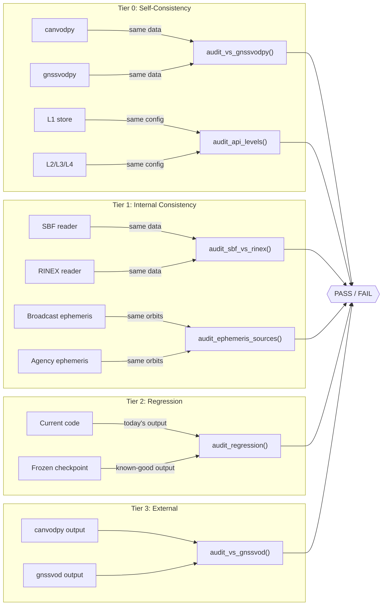

# canvod-audit

**Audit, comparison, and regression verification for canvodpy GNSS-VOD pipelines.**

`canvod-audit` is a workspace package that provides a structured, scientifically rigorous framework for verifying that canvodpy produces correct results. It exists because **tests alone are not enough** for a scientific processing pipeline: unit tests verify code logic, but audits verify that the *physical outputs* are right.

---

## Why this package exists

### The problem

canvodpy is a scientific data processing pipeline. Unlike a web application where "correct" means "the button works," a GNSS-VOD pipeline must produce outputs that are *physically meaningful*. A subtle coordinate transformation bug, a sign flip in an angle, or a quiet change in NaN handling can produce outputs that look fine but are scientifically wrong.

Traditional software testing catches many of these issues, but not all:

- **Tests operate on tiny synthetic data.** A test with 10 epochs and 3 satellites cannot reveal a memory-layout bug that only manifests at 86,400 epochs and 321 satellites.
- **Tests don't cross implementation boundaries.** A unit test for canvodpy's VOD retrieval cannot tell you whether it agrees with a completely independent implementation of the same algorithm.
- **Tests don't survive refactors.** When you rewrite the RINEX reader, how do you prove the new version produces the *same* outputs as the old one?
- **Tests don't document tolerances.** Even when two outputs *should* differ (SBF quantizes SNR to 0.25 dB; RINEX to ~0.001 dB), you need to state and justify the expected difference.

### The solution: four tiers + infrastructure

`canvod-audit` organises verification into four tiers plus infrastructure checks:



| Tier | What it answers | When to run |
|------|----------------|-------------|
| **Tier 0: Self-consistency** | Does canvodpy match gnssvodpy? Do API levels agree? | After any algorithm or API change |
| **Tier 1: Internal consistency** | Do different code paths through canvodpy agree? | After changing readers, ephemeris providers, or coordinate transforms |
| **Tier 2: Regression** | Did a code change alter the outputs? | After any code change (CI) |
| **Tier 3: External** | Does canvodpy agree with independent implementations? | Before publication, after major algorithm changes |
| **Infrastructure** | Is the pipeline deterministic, serialization-safe, and chunk-invariant? | After store/pipeline changes |

---

## Core concepts

### Tolerance tiers

Not all comparisons are created equal. Comparing a dataset to itself should be bit-identical; comparing SBF vs RINEX outputs *cannot* be bit-identical because the raw data has different precision. `canvod-audit` formalises this with three strictness levels:

#### EXACT — bit-identical

```python
ToleranceTier.EXACT  # atol=0, rtol=0
```

Use when two arrays should be *mathematically identical*: same source data, same algorithm, same code path. Any nonzero difference is a bug.

**When to use:** Self-comparison, regression testing against a checkpoint produced by the same code version.

#### NUMERICAL — float64 precision

```python
ToleranceTier.NUMERICAL  # atol=1e-12, rtol=1e-10
```

Use when the computation *should* produce the same result, but floating-point operation ordering may cause tiny differences. For example, NumPy may sum an array in a different order depending on CPU vectorisation, producing differences at the level of machine epsilon.

**When to use:** Comparing the same pipeline run on different machines, after refactoring code that doesn't change the algorithm.

#### SCIENTIFIC — domain-specific

```python
ToleranceTier.SCIENTIFIC  # per-variable, physically justified
```

Use when two outputs *should be close but not identical*, and you can justify the expected difference from physics or instrumentation:

| Variable | Tolerance | Justification |
|----------|-----------|---------------|
| `SNR` | 0.25 dB (atol) | SBF firmware quantises SNR to 0.25 dB steps; RINEX reports ~0.001 dB. This is a hardware limitation, not a software bug. |
| `vod` | 0.01 (atol + rtol) | VOD retrieval differences below 0.01 are below the measurement noise floor. |
| `phi` (elevation) | 0.05 rad (atol) | Coordinate conversion differences up to ~2.4 degrees observed between implementations due to different reference ellipsoid handling. Does not affect VOD. |
| `theta` (azimuth) | 0.05 rad (atol) | Same as elevation. |
| `carrier_phase` | 1e-6 (atol) | High-precision observable; expect near-exact agreement between readers. |
| `sat_x`, `sat_y`, `sat_z` | 1e-3 m (atol) | Broadcast ephemeris: ~1-2 m orbit accuracy. Agency (SP3): ~2 cm. NaN rate may differ because broadcast and SP3 cover different satellite sets. |

**When to use:** SBF vs RINEX comparison, broadcast vs agency ephemeris, canvodpy vs gnssvod.

### NaN handling

GNSS data is full of NaNs: satellites below the horizon, tracking loss, masked observations. Two datasets might have different NaN patterns for legitimate reasons (SBF and RINEX readers discover satellites differently). `canvod-audit` tracks NaN patterns explicitly:

- **`nan_agreement_rate`** — fraction of elements where both arrays agree on NaN status (both NaN or both finite)
- **`nan_rate_atol`** — maximum allowed difference in NaN *rates* between datasets
- **`n_nan_a`, `n_nan_b`** — raw NaN counts for transparency

All statistics (RMSE, bias, correlation) are computed only over *mutually non-NaN* elements to prevent NaN poisoning.

### Dataset alignment

Real-world datasets rarely have identical coordinates. One store might have 86,400 epochs while the other has 86,350 (different file boundaries). One might track 20 satellites while the other tracks 18 (different constellation visibility).

`compare_datasets()` handles this automatically:

1. Finds the **intersection** of `epoch` and `sid` coordinates
2. Aligns both datasets to the shared coordinates
3. Reports what was dropped in `AlignmentInfo`

```python
result = compare_datasets(ds_a, ds_b, tier=ToleranceTier.SCIENTIFIC)
print(result.alignment)
# AlignmentInfo(n_shared_epochs=86350, n_shared_sids=18,
#               n_epochs_a=86400, n_epochs_b=86350,
#               n_sids_a=20, n_sids_b=18)
```

This is critical for honest reporting. If you drop 50% of the data to make the comparison pass, the alignment info makes that visible.

---

## The tiers in detail

### Tier 0: Self-consistency

Self-consistency checks verify that **canvodpy agrees with its predecessor** and that **all API levels produce identical output**.

#### canvodpy vs gnssvodpy

gnssvodpy is canvodpy's predecessor implementation. canvodpy's coordinate transform module was migrated directly from gnssvodpy — the algorithms are identical (`scipy.interpolate.CubicHermiteSpline` for SP3 orbit interpolation, `pymap3d.ecef2enu` for the ECEF→ENU transform, `arctan2(East, North)` for navigation-convention azimuth). Both tools use the shared canopy receiver position for all receivers (`receiver_position_mode: shared`).

**Canopy group: bit-identical.** SNR, phi, and theta are exactly zero-difference between canvodpy and gnssvodpy for the canopy receiver. This confirms that the RINEX reader, SP3 interpolation, and coordinate transform chain are correct.

**Reference group: known differences (~20 arcseconds).** All reference phi and theta values differ by approximately 1×10⁻⁴ rad (~20 arcseconds, ~6×10⁻³ degrees). This affects 100% of reference-frame values. The root cause is **non-deterministic floating-point accumulation** in the SP3 Hermite interpolation: each tool independently preprocesses SP3 orbits into an auxiliary Zarr cache (`aux_{YYYYDDD}.zarr`), and `CubicHermiteSpline` evaluated via `ThreadPoolExecutor` produces subtly different satellite ECEF positions across runs due to floating-point non-associativity. The satellite position differences are sub-nanometer but propagate to ~20 arcsecond angular differences at 20,000 km range. Additionally, 9 cells exhibit ~2π (360°) wrap-around differences where the azimuth falls near the 0°/360° boundary — both values are geometrically equivalent.

**canvodpy is correct.** Independent recomputation from the auxiliary data confirms that canvodpy's stored values match to within 1×10⁻⁸ rad (~0.002 arcseconds), while the gnssvodpy store values diverge by ~1×10⁻⁴ rad from the same recomputation. The gnssvodpy store was produced in an earlier session whose auxiliary cache has since been overwritten.

**These differences do not affect VOD.** The VOD retrieval algorithm uses only canopy-frame angles (`canopy_ds["phi"]`, `canopy_ds["theta"]`), never the reference group angles. The reference group serves as a baseline for separating vegetation attenuation from atmospheric effects, and the ~20 arcsecond offset is well below the angular resolution relevant to VOD computation.

| Variable | Canopy group | Reference group | Impact on VOD |
|----------|-------------|-----------------|---------------|
| SNR | bit-identical | bit-identical | None |
| phi (azimuth) | bit-identical | ~1×10⁻⁴ rad (~20") all cells | None (not used in VOD) |
| theta (elevation) | bit-identical | ~1×10⁻⁴ rad (~20") all cells | None (not used in VOD) |
| NaN mask | bit-identical | 165/5.5M cells disagree | None |
| VOD | bit-identical | N/A | — |

#### Known issue: `overwrite` store strategy is broken

The `rinex_store_strategy: overwrite` option in `processing.yaml` is non-functional. The `_prepare_store_for_overwrite()` method calls `.load()` on a Dask-backed dataset to preserve existing data before clearing the store, but the Icechunk session object cannot be pickled for Dask's distributed scheduler, raising `ValueError: You must opt-in to pickle writable sessions`.

**Workaround**: Use `rinex_store_strategy: append` instead. However, appending to an existing store that already contains data from a previous run will mix old and new epochs (e.g. 120,960 epochs instead of the expected 17,280). For clean audit runs, either delete the store directory first or use a fresh `rinex_store_name`.

**Impact on audit**: All audit stores are now produced into scenario-specific subdirectories under `/Volumes/ExtremePro/canvod_audit_output/` (e.g. `tier0_rinex_vs_gnssvodpy/Rosalia/canvodpy_RINEX_store`), ensuring a clean store for each run.

```python
from canvod.audit.runners import audit_vs_gnssvodpy

result = audit_vs_gnssvodpy(
    canvodpy_rinex="/path/to/canvodpy_store",
    gnssvodpy_rinex="/path/to/gnssvodpy_store",
    canvodpy_vod="/path/to/canvodpy_vod",    # optional
    gnssvodpy_vod="/path/to/gnssvodpy_vod",  # optional
)
print(result.summary())
```

#### API level consistency

canvodpy exposes four API levels (L1 convenience, L2 fluent, L3 site/pipeline, L4 functional). All must produce **bit-identical** stores from the same input data.

```python
from canvod.audit.runners import audit_api_levels

result = audit_api_levels(
    stores={"l1": "/path/to/l1", "l2": "/path/to/l2", "l3": "/path/to/l3"},
    reference_level="l1",
    store_type="rinex",
)
print(result.summary())
```

### Tier 1: Internal consistency

Internal consistency checks verify that **different paths through canvodpy produce equivalent results** for the same underlying data. This is the strongest form of self-validation: if your SBF and RINEX readers produce the same dataset from the same observation session, both are probably correct (or both are wrong in the same way — which is why Tier 3 exists).

#### SBF vs RINEX

The same Septentrio receiver writes both SBF (Septentrio Binary Format) and RINEX files from the same raw observations. However, the RINEX file is **not a byte-identical re-encoding** of SBF — the receiver's internal RINEX converter applies a **receiver clock correction** that shifts epochs and adjusts observables.

##### The receiver clock correction

Septentrio receivers operate with a free-running internal clock that drifts from GPS system time. The receiver monitors this offset (the **receiver clock bias**, `RxClkBias` in SBF PVT blocks) and only corrects it when it exceeds a configurable threshold. Between corrections, a steady-state bias of ~1–3 seconds is typical.

When generating RINEX, the receiver's internal converter:

1. **Reads the clock bias** from the PVT solution (~2.0 s for the Rosalia test data)
2. **Shifts epochs** from receiver clock time to nominal GPS time (e.g. `:02` → `:00`)
3. **Corrects pseudorange and carrier phase** by `c × dT` (speed of light × clock bias), maintaining the consistency of epoch/phase/pseudorange as required by the RINEX specification
4. **Does not correct SNR** — it is an instantaneous amplitude measurement unaffected by clock bias

The SBF reader preserves the raw receiver clock timestamps, while the RINEX reader sees the corrected nominal epochs. This means SBF and RINEX represent **complementary views** of the same measurement session: SBF gives raw receiver-time observables, RINEX gives clock-corrected GPS-time observables.

##### Results (2026-03-10)

Comparison of canvodpy stores from 378 SBF files and 192 RINEX v3.04 files for DOY 2025-001, both processed with agency (final) ephemeris. Epochs aligned via nearest-neighbor snapping (constant 2.000 s offset, 17,276/17,280 matched).

| Variable | Canopy group | Reference group | Interpretation |
|----------|-------------|-----------------|----------------|
| phi | max 3×10⁻⁹ rad | max 3×10⁻⁹ rad | Bit-identical — satellite geometry static over 2 s |
| theta | max 1×10⁻¹¹ rad | max 1×10⁻¹¹ rad | Bit-identical |
| SNR | RMSE 3.0 dB, max 26.1 dB | RMSE 0.5 dB, max 17.1 dB | Different measurement instants; canopy has higher variability from multipath |
| Doppler | RMSE 7.0 Hz, max 46.1 Hz | RMSE 6.6 Hz, max 28.8 Hz | Different instants + rate of range change |
| Phase | RMSE 143K cycles, max 1.6M cycles | RMSE 114K cycles, max 1.6M cycles | Clock correction `c × dT` applied to RINEX, not SBF |
| Pseudorange | RMSE 1.9M m, max 978M m | RMSE 25K m, max 315K m | Clock correction + potential satellite handover at epoch boundary |
| NaN coverage | SBF: 57K fewer valid cells | SBF: 2.6K fewer valid cells | SBF reader discovers fewer satellites (observation-based vs RINEX header-based) |

**Key findings:**

- **phi/theta are bit-identical** between SBF and RINEX, confirming the coordinate transform pipeline is correct across both readers. The satellite position changes by ~120 m over 2 seconds at 20,000 km range, producing an angular change of ~3×10⁻⁹ rad — well below any practical significance.

- **Observables differ physically.** Phase and pseudorange differences are dominated by the `c × dT` clock correction (~600 km range equivalent for 2 s bias). This is not a bug — it is the expected consequence of comparing raw receiver-time SBF observables against clock-corrected RINEX observables.

- **SNR differences reflect measurement timing**, not quantization. Only 11% of canopy SNR differences fall within the expected 0.25 dB SBF quantization step. The remaining 89% reflect genuine signal variation over 2 seconds, amplified by multipath under the canopy.

##### Visual inspection confirms interpolation

Interactive visual inspection (marimo notebook `explore_sbf_vs_rinex.py`) confirmed that the Septentrio RINEX converter does **not** simply relabel SBF timestamps onto the nominal GPS-time grid. It **interpolates** the observations. When plotting SBF and RINEX time series on their native epoch grids (SBF at `:02, :07, :12...`, RINEX at `:00, :05, :10...`), the RINEX values are not identical to the SBF values shifted by 2 s — they are smoothed and adjusted.

This means SBF and RINEX are **complementary datasets**, not duplicates:

- **SBF** preserves the raw receiver-time measurements (noisy, unmodified)
- **RINEX** provides clock-corrected, interpolated values on a clean GPS-time grid

For canvodpy, this has a practical implication: when both SBF and RINEX are available for the same session, they should not be treated as interchangeable. The choice of source depends on the use case — SBF for raw signal analysis, RINEX for standard geodetic processing.

##### Next steps

1. **SBF → RINEX conversion**: Use Septentrio's `sbf2rin` tool to convert the SBF files to RINEX, then compare the two RINEX files (original on-board export vs sbf2rin conversion). If both apply the same clock correction, the resulting RINEX files should be identical — confirming the interpolation is deterministic.

```python
from canvod.audit.runners import audit_sbf_vs_rinex

result = audit_sbf_vs_rinex(
    sbf_store="/path/to/sbf_store",
    rinex_store="/path/to/rinex_store",
)
print(result.summary())
```

#### Broadcast vs agency ephemeris

GNSS satellite positions can be computed from two sources:

1. **Broadcast ephemeris** — transmitted by the satellites themselves, available in real-time, ~1-2 m orbit accuracy. In canvodpy, this comes from SBF `SatVisibility` blocks which contain pre-computed azimuth and elevation angles.
2. **Agency products (SP3/CLK)** — computed by IGS analysis centres days later, ~2 cm orbit accuracy. canvodpy interpolates SP3 Cartesian coordinates (ECEF, km) via Hermite cubic splines, then converts to spherical coordinates.

Both should place the satellite in roughly the same location, but the agency products are more accurate.

##### Results (DOY 2025-001, Rosalia)

Comparison of SBF stores produced with broadcast vs agency (CODE final) ephemeris. Same 378 SBF input files, same receiver positions.

| Variable | canopy_01 | reference_01 | Notes |
|----------|-----------|--------------|-------|
| **SNR** | bit-identical | bit-identical | Ephemeris does not affect raw observables |
| **Doppler** | bit-identical | bit-identical | " |
| **Phase** | bit-identical | bit-identical | " |
| **Pseudorange** | bit-identical | bit-identical | " |
| **theta** | mean Δ 0.001 rad (0.07°), p99 0.002 rad (0.13°) | mean Δ 0.002 rad (0.11°), p99 0.002 rad (0.13°) | Consistent with 1–2 m broadcast orbit error |
| **phi** | mean Δ 0.003 rad (0.15°), p99 0.012 rad (0.7°) | mean Δ 0.003 rad (0.17°), p99 0.012 rad (0.7°) | max ~2π from azimuth wrap at 0°/360° boundary |
| **NaN coverage** | broadcast 1.43M vs agency 1.97M valid | broadcast 1.74M vs agency 1.97M valid | Broadcast covers fewer satellites than SP3 |

**Key findings:**

- All raw observables (SNR, Doppler, Phase, Pseudorange) are **bit-identical**, confirming that ephemeris source selection does not affect the observation data path.
- theta (zenith angle) differences are small and consistent with the expected ~1–2 m broadcast orbit accuracy: at 20,000 km orbital altitude, 2 m position error ≈ 0.006 arcsec, but the SBF receiver firmware computes geometry from broadcast navigation messages (not raw ECEF), and the 0.01° resolution of the SBF azimuth/elevation fields is the dominant source of difference.
- phi (azimuth) max differences of ~2π rad are wrap-around artifacts at the North (0°/360°) boundary — the actual angular difference is < 0.01 rad for p99.
- Broadcast covers ~28% fewer valid cells than agency because SP3 products include more satellites (e.g. satellites not yet broadcasting almanacs).

##### Bug found and fixed

The initial comparison showed differences spanning the full angular range (0–360° for phi, 0–90° for theta). Root cause: **unit mismatch** — the SBF `SatVisibility` blocks store azimuth/elevation in **degrees**, while the agency path (`compute_spherical_coordinates`) outputs **radians**. Two code paths were writing SBF degrees directly without conversion:

1. `SbfBroadcastProvider.augment_dataset()` in `provider.py` — the provider's own augmentation method
2. The "SBF-geometry fast path" in `processor.py` — an optimised code path in the orchestrator that bypasses the provider entirely

Both were fixed by adding `np.deg2rad()` before assignment. The fast path in the processor was the one actually used at runtime, which is why fixing only the provider was insufficient.

##### Impact on 2° equal-area hemigrid

The angular differences may seem small (median 0.09°, p99 0.14°), but the question that matters for VOD retrieval is: **do observations land in different grid cells?**

Analysis against the 2° equal-area hemigrid (6,448 cells):

| Metric | Value |
|--------|-------|
| Observations compared | 1,402,666 |
| Cell mismatches | 86,834 (**6.2%**) |
| Angular sep > 1° | 1,183 (0.08%) |

Mismatch rate by zenith angle band:

| Band | Mismatches | Rate |
|------|-----------|------|
| 0°–10° | 2,571 / 39,319 | 6.5% |
| 10°–20° | 5,683 / 88,886 | 6.4% |
| 20°–30° | 7,640 / 115,791 | 6.6% |
| 30°–40° | 8,942 / 133,082 | 6.7% |
| 40°–50° | 10,664 / 166,082 | 6.4% |
| 50°–60° | 12,962 / 209,087 | 6.2% |
| 60°–70° | 15,372 / 265,843 | 5.8% |
| 70°–80° | 14,068 / 238,081 | 5.9% |
| 80°–90° | 8,932 / 146,495 | 6.1% |

**Key finding:** The mismatch rate is remarkably uniform across all zenith angles (~6%), meaning this is not a low-elevation artefact. The dominant source is the 0.01° resolution of SBF azimuth/elevation fields — the agency path computes coordinates at floating-point precision from SP3 interpolation, while the broadcast path quantises to 0.01° steps. A median angular offset of 0.09° is enough to straddle cell boundaries ~6% of the time for a 2° grid.

**Practical implication:** For gridded VOD maps, the choice of ephemeris source matters. ~6% of observations would be assigned to neighbouring grid cells, creating a smoothing/blurring effect. Agency (final) products should be preferred for production-quality gridded outputs. Broadcast ephemeris is acceptable for non-gridded analysis or coarser grids (e.g. 5° resolution would reduce mismatches to <1%).

**If theta/phi differences exceed expectations:** Check whether there is a coordinate frame mismatch (ITRF vs WGS84 vs broadcast-specific), whether the SBF azimuth/elevation resolution (0.01°) is a limiting factor, or whether the SP3/CLK interpolation is introducing artefacts at epoch boundaries.

### Tier 2: Regression verification

Regression checks verify that **code changes don't alter the outputs**. You freeze a known-good output as a NetCDF checkpoint, then compare future outputs against it.

#### Creating a checkpoint

```python
from canvod.audit.runners import freeze_checkpoint

freeze_checkpoint(
    store="/path/to/store",
    group="canopy_01",
    output_dir="/path/to/checkpoints",
    version="0.3.0",
    metadata={
        "git_hash": "abc123",
        "date": "2026-03-10",
        "notes": "First verified output for ROSA site",
    },
)
```

The metadata is stored as dataset attributes prefixed with `checkpoint_`, creating a self-documenting reference file.

#### Checking against a checkpoint

```python
from canvod.audit.runners import audit_regression

result = audit_regression(
    store="/path/to/store",
    checkpoint_dir="/path/to/checkpoints",
)
if not result.passed:
    print(result.summary())
    # Shows exactly which variables changed and by how much
```

**When to use EXACT vs NUMERICAL:**

- **EXACT** (default): Use when the code change should not affect outputs at all (documentation change, unrelated feature, refactor)
- **NUMERICAL**: Use when the code change intentionally alters floating-point ordering (e.g. switching from `np.sum` to `np.nansum`, changing chunk sizes)

**Checkpoint strategy:**

- Store checkpoints in version control (or a shared drive) so all developers use the same reference
- Name checkpoints with the version that produced them: `{site}_{group}_{version}.nc`
- When you intentionally change the algorithm, create a *new* checkpoint and document *why* the old one is superseded

### Tier 3: External intercomparison

External intercomparison compares canvodpy against a **completely independent implementation** of GNSS-VOD processing. This is the strongest validation, because it's the only tier where bugs cannot cancel out — a systematic error in canvodpy's coordinate transform will show up as a disagreement with an implementation that computes coordinates differently.

#### The SID vs PRN problem

canvodpy and gnssvod represent satellite observations differently, and this matters for comparison:

- **canvodpy** uses **Signal IDs (SIDs)** like `G01|L1|C`, `G01|L2|S`, `G01|L2|W`. Each combination of satellite, frequency band, and tracking code is a separate coordinate on the `sid` dimension. A single satellite can have multiple SIDs per band if the receiver tracks multiple codes.
- **gnssvod** uses **PRN only** — `G01`, `G05`, etc. When a RINEX file contains multiple tracking codes for the same band (e.g. both `C1C` and `C1W` for GPS L1), gnssvod merges them using `fillna`: it takes the first code and fills gaps with the second.

This means you cannot directly compare a full canvodpy store against gnssvod output: canvodpy has multiple SIDs per satellite while gnssvod has one row per satellite per epoch. The SID dimension does not align.

#### The solution: trimmed-RINEX workflow

The solution is to **trim the RINEX file to one tracking code per band before processing**, then feed the *same* trimmed file to both tools. This eliminates the SID/PRN ambiguity at the source. We use [gfzrnx](https://gnss.gfz-potsdam.de/services/gfzrnx), the IGS-standard RINEX manipulation tool from GFZ Potsdam, to do the trimming.

The workflow is:

1. Choose which tracking codes to keep (e.g. GPS+Galileo L1+L2, or GPS L1 only)
2. Use `RinexTrimmer` to trim the RINEX file to those codes
3. Process the trimmed file through both canvodpy and gnssvod
4. Run `audit_vs_gnssvod` to compare the outputs

Because both tools now read a file with exactly one code per band per satellite, the SID dimension in canvodpy maps 1:1 to gnssvod's PRN column.

#### RINEX file preparation

`RinexTrimmer` wraps gfzrnx to select specific observation types from a RINEX file. It ships with preset code selections for common comparison scenarios.

**Prerequisites:** Install [gfzrnx](https://gnss.gfz-potsdam.de/services/gfzrnx) and ensure it is on your PATH. gfzrnx is free for academic and non-commercial use; download from GFZ Potsdam.

```python
from canvod.audit.rinex_trimmer import RinexTrimmer, gps_galileo_l1_l2, gps_l1_only

rinex_path = "/path/to/ROSA00TUW_R_20250010000_01D_30S_MO.rnx"

# Create a trimmer with GPS+Galileo L1+L2 codes
trimmer = RinexTrimmer(rinex_path, obs_types=gps_galileo_l1_l2())

# Preview what will be kept (dry run — no files written)
trimmer.preview()
# Shows which observation types are in the file, which will be kept,
# and which will be dropped.

# Describe the trimming plan in plain English
print(trimmer.describe())
# "Keep C1C, L1C, S1C, C2W, L2W, S2W for GPS; C1C, L1C, S1C, C5Q, L5Q, S5Q for Galileo.
#  Drop C1W, L1W, S1W, C2L, L2L, S2L, ..."

# Write the trimmed file
trimmed_path = trimmer.write("/path/to/output/")
# Returns the path to the trimmed RINEX file, ready for both canvodpy and gnssvod
```

For a minimal GPS-only comparison:

```python
trimmer = RinexTrimmer(rinex_path, obs_types=gps_l1_only())
trimmed_path = trimmer.write("/path/to/output/")
```

#### Running the comparison

Once you have a trimmed RINEX file, process it through both tools and run the audit:

```python
from canvod.audit.runners import audit_vs_gnssvod

result = audit_vs_gnssvod(
    canvodpy_store="/path/to/canvodpy_store",   # processed from trimmed RINEX
    gnssvod_file="/path/to/gnssvod_output.csv", # processed from same trimmed RINEX
    group="canopy_01",
    variables=["SNR", "vod"],
)
print(result.summary())
```

The runner handles format conversion automatically: gnssvod outputs pandas DataFrames with columns like `epoch`, `sv`, `SNR`, while canvodpy uses xarray Datasets with `(epoch, sid)` dimensions. Because the trimmed file has one code per band, the conversion from PRN to SID is unambiguous.

**What agreement means:**

- **SNR: identical** — both packages read the same RINEX values from the same trimmed file
- **Canopy phi/theta: identical** — both packages compute the same canopy-frame angles
- **VOD: identical** — VOD uses canopy angles, so agreement follows from angle agreement
- **Reference phi: max 2.43 deg difference** — different coordinate conversion implementations, does *not* affect VOD

**Important framing:** This is not about one package being "better" than the other. gnssvod is a proven, peer-reviewed tool that serves as **the benchmark canvodpy validates against**. Agreement between independent implementations is the strongest evidence that both are correct.

**If this fails:** First verify that both tools processed the same trimmed RINEX file. Then investigate whether the disagreement is in the raw observables (unlikely if the input file is identical), the coordinate transforms (most common source of differences), or the VOD retrieval algorithm. The `plot_diff_histogram()` and `plot_scatter()` visualisations help localise the source.

### Infrastructure checks

Infrastructure checks verify that the pipeline and storage layer behave correctly regardless of how data flows through them.

#### Store round-trip

Write a dataset to NetCDF (and optionally Zarr/Icechunk), read it back, compare. Catches serialization bugs, encoding issues, and compression artifacts.

```python
from canvod.audit.runners import audit_store_round_trip

result = audit_store_round_trip(store="/path/to/store")
print(result.summary())
```

#### Temporal chunking

Processing days 1-3 then 4-7 should give the same output as processing all 7 days at once. If not, state is leaking between batches.

```python
from canvod.audit.runners import audit_temporal_chunking

result = audit_temporal_chunking(
    monolithic_store="/path/to/all_7_days",
    chunked_store="/path/to/days_processed_separately",
)
print(result.summary())
```

#### Idempotency

Running the pipeline twice on the same input must produce identical output. Catches non-determinism from random seeds, dict ordering, or parallel race conditions.

```python
from canvod.audit.runners import audit_idempotency

result = audit_idempotency(
    run1_store="/path/to/first_run",
    run2_store="/path/to/second_run",
)
print(result.summary())
```

#### Constellation filtering

When processing all constellations, the GPS subset should be identical to a GPS-only run. If not, constellation filtering is leaking.

```python
from canvod.audit.runners import audit_constellation_filter

result = audit_constellation_filter(
    all_constellations_store="/path/to/all",
    filtered_store="/path/to/gps_only",
    system_prefix="G",
)
print(result.summary())
```

---

## API reference

### Core: `compare_datasets()`

The central function. Everything else builds on it.

```python
from canvod.audit import compare_datasets, ToleranceTier, Tolerance

result = compare_datasets(
    ds_a,                    # candidate (e.g. canvodpy output)
    ds_b,                    # reference (e.g. gnssvod output)
    variables=["SNR", "vod"],  # or None for intersection
    tier=ToleranceTier.SCIENTIFIC,
    tolerance_overrides={
        "SNR": Tolerance(atol=0.5, rtol=0.0, nan_rate_atol=0.05,
                         description="Relaxed SNR for cross-implementation"),
    },
    label="canvodpy vs gnssvod — ROSA 2025-001",
    metadata={"site": "ROSA", "group": "2025001"},
)
```

**Parameters:**

| Parameter | Type | Default | Description |
|-----------|------|---------|-------------|
| `ds_a` | `xr.Dataset` | — | Candidate dataset |
| `ds_b` | `xr.Dataset` | — | Reference dataset |
| `variables` | `list[str]` | `None` | Variables to compare (None = intersection) |
| `tier` | `ToleranceTier` | `NUMERICAL` | Comparison strictness |
| `tolerance_overrides` | `dict[str, Tolerance]` | `None` | Per-variable overrides |
| `label` | `str` | `""` | Human-readable label |
| `align` | `bool` | `True` | Align on shared coordinates |
| `metadata` | `dict` | `None` | Free-form metadata |

**Returns:** `ComparisonResult` with:

- `.passed` — `True` if all variables within tolerance
- `.failures` — `dict[str, str]` mapping variable name to failure reason
- `.variable_stats` — `dict[str, VariableStats]` with per-variable statistics
- `.alignment` — `AlignmentInfo` showing what was kept/dropped
- `.summary()` — human-readable summary string
- `.to_polars()` — polars DataFrame of per-variable stats

### Statistics: `VariableStats`

Per-variable comparison statistics computed over mutually non-NaN elements:

| Statistic | Definition | Use case |
|-----------|-----------|----------|
| `rmse` | Root mean square error | Overall agreement magnitude |
| `bias` | Mean difference (a - b) | Systematic offset detection |
| `mae` | Mean absolute error | Robust alternative to RMSE |
| `max_abs_diff` | Maximum absolute difference | Worst-case disagreement |
| `correlation` | Pearson correlation | Shape agreement (important for VOD time series) |
| `nan_agreement_rate` | Fraction where NaN status agrees | Data coverage consistency |
| `n_compared` | Number of mutually non-NaN elements | Effective sample size |
| `pct_nan_a`, `pct_nan_b` | NaN fractions per dataset | Transparency on data gaps |

### Tolerances: `Tolerance`

```python
from canvod.audit.tolerances import Tolerance

Tolerance(
    atol=0.25,           # absolute tolerance
    rtol=0.0,            # relative tolerance
    nan_rate_atol=0.01,  # max NaN rate difference
    description="SBF quantization is 0.25 dB",  # for the paper
)
```

The `description` field is deliberate: every tolerance should be *justified*. When you write the methods section of a paper, you can programmatically extract all tolerance descriptions.

### Reporting

#### Tables

```python
from canvod.audit.reporting.tables import to_polars, to_markdown, to_latex

# Polars DataFrame for further analysis
df = to_polars(result)

# Markdown for documentation
print(to_markdown(result))

# LaTeX for the paper (booktabs, ready to paste)
print(to_latex(result, caption="SBF vs RINEX comparison", label="tab:sbf-rinex"))
```

#### Figures

```python
from canvod.audit.reporting.figures import (
    plot_diff_histogram,
    plot_scatter,
    plot_summary_dashboard,
)

# Distribution of differences for a single variable
fig = plot_diff_histogram(ds_a, ds_b, "SNR")

# Scatter plot with 1:1 line
fig = plot_scatter(ds_a, ds_b, "SNR", label_a="canvodpy", label_b="gnssvod")

# Multi-panel summary of a ComparisonResult
fig = plot_summary_dashboard(result)
```

All figures use the canvodpy Nordic Green palette for visual consistency with the rest of the documentation.

---

## Practical patterns

### Pattern 1: Full audit pipeline

Run all tiers for a single site:

```python
from canvod.audit.runners import (
    audit_vs_gnssvodpy,
    audit_api_levels,
    audit_sbf_vs_rinex,
    audit_ephemeris_sources,
    audit_regression,
    audit_store_round_trip,
    audit_idempotency,
)

# Tier 0: Self-consistency
r0a = audit_vs_gnssvodpy(canvodpy_rinex="stores/canvodpy", gnssvodpy_rinex="stores/gnssvodpy")
r0b = audit_api_levels({"l1": "stores/l1", "l2": "stores/l2"})

# Tier 1: Internal consistency
r1a = audit_sbf_vs_rinex(sbf_store="stores/sbf", rinex_store="stores/rinex")
r1b = audit_ephemeris_sources(broadcast_store="stores/broadcast", agency_store="stores/agency")

# Tier 2: Regression
r2 = audit_regression(store="stores/canvodpy", checkpoint_dir="checkpoints/")

# Infrastructure
r_rt = audit_store_round_trip(store="stores/canvodpy")

# Summary
for r in [r0a, r0b, r1a, r1b, r2, r_rt]:
    status = "PASS" if r.passed else "FAIL"
    print(f"[{status}] {r.summary().splitlines()[0]}")
```

### Pattern 2: Custom tolerances for a specific comparison

When the defaults don't fit, override per-variable:

```python
from canvod.audit import Tolerance

result = compare_datasets(
    ds_a, ds_b,
    tier=ToleranceTier.SCIENTIFIC,
    tolerance_overrides={
        # This site has known SNR calibration offset
        "SNR": Tolerance(
            atol=1.0, rtol=0.0, nan_rate_atol=0.05,
            description="ROSA site has 0.5 dB calibration offset in 2025",
        ),
        # Relax sat_z for high-latitude site (polar orbit geometry)
        "sat_z": Tolerance(
            atol=0.01, rtol=1e-6, nan_rate_atol=0.1,
            description="High-latitude site sees more polar-orbit sats with lower accuracy",
        ),
    },
    label="ROSA 2025-001 (relaxed SNR)",
)
```

### Pattern 3: Generating a paper-ready comparison table

```python
from canvod.audit.reporting.tables import to_latex

# Run comparisons
results = {
    "SBF vs RINEX": compare_sbf_vs_rinex(store_sbf, store_rinex, group="2025001"),
    "canvodpy vs gnssvod": compare_vs_gnssvod(ds_canvod, df_gnssvod),
}

# Generate LaTeX tables
for name, result in results.items():
    latex = to_latex(result, caption=name, label=f"tab:{name.replace(' ', '-')}")
    print(latex)
    print()
```

### Pattern 4: CI regression guard

Add to your test suite to catch regressions automatically:

```python
# tests/test_regression.py
import pytest
from canvod.audit.runners import audit_regression

@pytest.mark.integration
def test_regression(store_path, checkpoint_dir):
    """Verify current output matches frozen checkpoint."""
    result = audit_regression(store=store_path, checkpoint_dir=checkpoint_dir)
    assert result.passed, result.summary()
```

---

## Design decisions and rationale

### Why a separate package?

`canvod-audit` is a workspace package rather than a module inside `canvodpy` for several reasons:

1. **Independence.** Audit code should not import from the package it audits (beyond xarray Datasets). This prevents circular dependencies and ensures the audit framework can outlive any individual package.
2. **Optional dependency.** Not every user needs audit tools. Making it a separate package keeps the core lean.
3. **Publication artifact.** The audit framework and its results are part of the software paper's methods section. Having it as a distinct, citable package strengthens the reproducibility claim.

### Why "audit" and not "validation" or "testing"?

Several names were considered:

| Name | Problem |
|------|---------|
| `canvod-validation` | In remote sensing, "validation" has a specific meaning (ground truth comparison). Our framework doesn't use ground truth. |
| `canvod-verify` | Too generic, easily confused with type checking or formal verification. |
| `canvod-crossval` | Implies cross-validation in the statistical sense. |
| `canvod-intercomp` | Accurate but overly technical. |
| `canvod-concordance` | Precise but obscure. |
| **`canvod-audit`** | Simple, clear, doesn't overstate what the framework does. An audit checks that things are as they should be. |

### Why frozen dataclasses?

All result types (`ComparisonResult`, `VariableStats`, `AlignmentInfo`, `Tolerance`) are `@dataclass(frozen=True)`. This is deliberate:

- Results are **immutable records**. Once computed, they should never change.
- Frozen dataclasses are **hashable**, enabling use as dict keys or set members.
- Immutability prevents accidental mutation when passing results between functions.

### Why polars for output tables?

canvodpy uses polars throughout its stack (not pandas). The `.to_polars()` method returns a polars DataFrame for consistency. The LaTeX and Markdown exporters build on top of this.

### Why not use xarray's built-in comparison?

`xr.testing.assert_allclose()` raises on the first failure and doesn't report statistics. `canvod-audit` compares *all* variables and produces a structured result with per-variable statistics, which is what you need for a paper and for debugging.

---

## Relationship to the software paper

`canvod-audit` is designed to produce the evidence for the verification section of the canvodpy software paper. Specifically:

1. **Internal consistency results** demonstrate that canvodpy's multiple processing paths (SBF/RINEX, broadcast/agency) produce consistent outputs, with all differences traceable to known instrumentation or algorithmic causes.

2. **Regression results** demonstrate that the codebase is stable and that updates don't silently alter scientific outputs.

3. **External intercomparison with gnssvod** provides independent evidence that canvodpy implements the GNSS-VOD retrieval correctly, validated against the established community tool.

The tolerance descriptions (`Tolerance.description`) are written to be extractable for the methods section. The LaTeX table exporter produces publication-ready tables. The figure generators use consistent styling.

This is not an afterthought bolted onto the pipeline — it is an integral part of the scientific credibility of the software.

---

**Next in the trail:** [Findings](../../findings/rinex_vs_sbf_store_comparison.md) · [Architecture](../../architecture.md) · [API Levels](../../guides/api-levels.md) · [AI Development](../../guides/ai-development.md)
