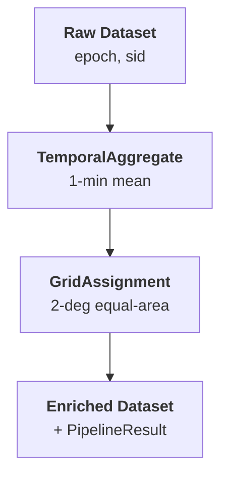

# canvod-ops

## Purpose

The `canvod-ops` package provides a configurable preprocessing pipeline that
transforms raw GNSS observation datasets during ingestion. Operations are applied
as a chain: each operation receives a dataset, transforms it, and passes the
result to the next.

---

## Pipeline

A `Pipeline` is an ordered sequence of operations (`Op` instances). It processes
a dataset through each operation and collects metadata about what happened:

```python
from canvod.ops import Pipeline, TemporalAggregate, GridAssignment

pipeline = Pipeline([
    TemporalAggregate(freq="1min", method="mean"),
    GridAssignment(grid_type="equal_area", angular_resolution=2.0),
])

ds_out, result = pipeline(ds_in)

# result.to_metadata_dict() → stored in dataset attrs for reproducibility
```



---

## Built-in Operations

### TemporalAggregate

Aggregates observations into regular time bins. Reduces the number of epochs by
grouping into frequency buckets and computing the mean or median.

```python
from canvod.ops import TemporalAggregate

op = TemporalAggregate(freq="1min", method="mean")
ds_out, result = op(ds_in)
```

| Parameter | Default | Description |
|-----------|---------|-------------|
| `freq` | `"1min"` | Target frequency (pandas offset alias) |
| `method` | `"mean"` | Aggregation: `"mean"` or `"median"` |

If the dataset is already at or coarser than the target frequency, the operation
is a no-op and returns the dataset unchanged.

### GridAssignment

Assigns each observation to a spatial grid cell based on its spherical coordinates
(`phi`, `theta`). Adds a `cell_id_*` variable to the dataset.

```python
from canvod.ops import GridAssignment

op = GridAssignment(grid_type="equal_area", angular_resolution=2.0)
ds_out, result = op(ds_in)
# ds_out now has cell_id_equal_area_2.0deg(epoch, sid)
```

| Parameter | Default | Description |
|-----------|---------|-------------|
| `grid_type` | `"equal_area"` | Grid builder name |
| `angular_resolution` | `2.0` | Resolution in degrees |

If the dataset is missing `phi` or `theta` coordinates, the operation is skipped.

---

## Op and OpResult

All operations inherit from the `Op` abstract base class:

```python
from canvod.ops import Op, OpResult

class MyOp(Op):
    @property
    def name(self) -> str:
        return "my_operation"

    def __call__(self, ds: xr.Dataset) -> tuple[xr.Dataset, OpResult]:
        # transform ds
        return ds, OpResult(
            op_name=self.name,
            parameters={...},
            input_shape=dict(ds.sizes),
            output_shape=dict(ds.sizes),
            duration_seconds=elapsed,
        )
```

Each `OpResult` records:

- Operation name and parameters
- Input/output dataset dimensions
- Execution time
- Optional notes (e.g., "no-op: data already at target frequency")

The `PipelineResult` aggregates all `OpResult` objects and can be serialized
to dataset attributes via `to_metadata_dict()`.

---

## Config-Driven Pipeline

The default pipeline is built from `processing.yaml` configuration:

```yaml
preprocessing:
  temporal_aggregation:
    enabled: true
    freq: "1min"
    method: mean
  grid_assignment:
    enabled: true
    grid_type: equal_area
    angular_resolution: 2.0
```

```python
from canvod.ops import build_default_pipeline

pipeline = build_default_pipeline()  # reads from config
ds_out, result = pipeline(ds_in)
```

Set `enabled: false` to skip an operation. The pipeline is empty if all
operations are disabled.
