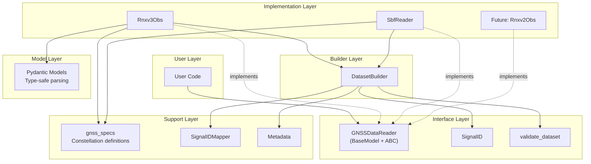
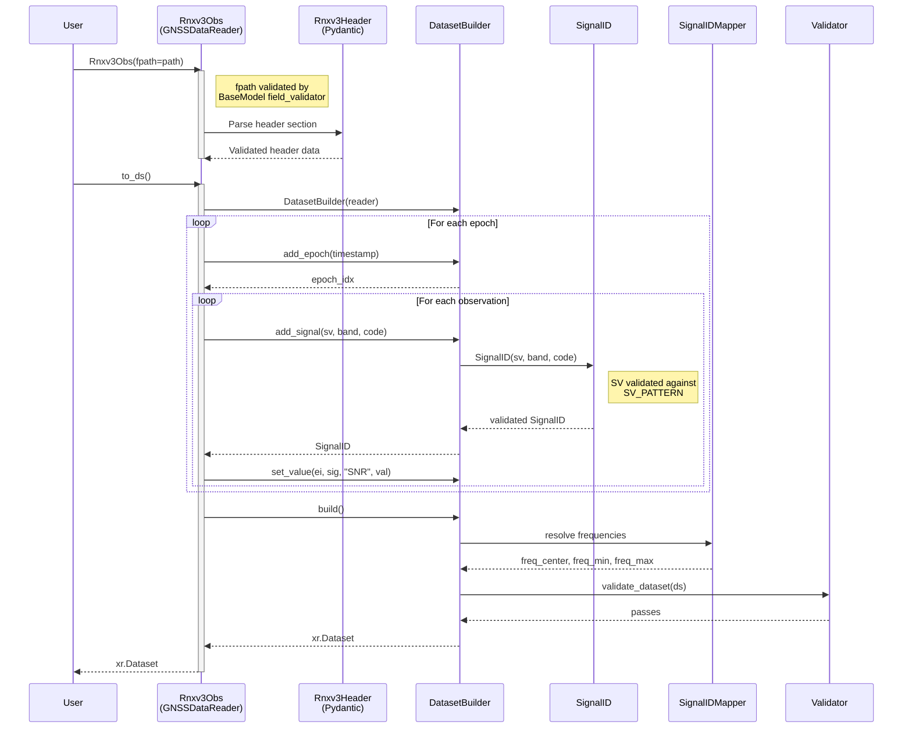

# Reader Architecture

This page describes the architectural principles behind canvod-readers, with particular focus on the `GNSSDataReader` base class — a Pydantic `BaseModel` combined with Python's Abstract Base Class (ABC) pattern — which ensures extensibility, type safety, and consistency across reader implementations.

## The `GNSSDataReader` Base Class

`GNSSDataReader` inherits from both `pydantic.BaseModel` and `abc.ABC`. This combination provides:

- **Contract enforcement** — all readers must implement required abstract methods
- **Automatic validation** — file path existence is checked at construction time via Pydantic
- **Type safety** — for static type checkers and runtime validation
- **Simplified inheritance** — subclasses inherit `fpath`, file validation, and `model_config` for free
- **Self-documenting interface** — abstract methods define the exact contract

The class is located in `canvod/readers/base.py`:

```python
from abc import ABC, abstractmethod
from pathlib import Path
from pydantic import BaseModel, ConfigDict, field_validator
import xarray as xr

class GNSSDataReader(BaseModel, ABC):
    """Abstract base for all GNSS data format readers.

    All readers must:
    1. Inherit from this class (no need for separate BaseModel)
    2. Implement all abstract methods
    3. Return xarray.Dataset that passes validate_dataset()
    4. Provide file hash for deduplication
    """

    model_config = ConfigDict(arbitrary_types_allowed=True)

    fpath: Path  # Validated at construction time

    @field_validator("fpath")
    @classmethod
    def _validate_fpath(cls, v: Path) -> Path:
        v = Path(v)
        if not v.is_file():
            raise FileNotFoundError(f"File not found: {v}")
        return v

    @property
    @abstractmethod
    def file_hash(self) -> str:
        """SHA256 hash of file for deduplication."""

    @abstractmethod
    def to_ds(
        self,
        keep_data_vars: list[str] | None = None,
        **kwargs
    ) -> xr.Dataset:
        """Convert data to xarray.Dataset."""

    @abstractmethod
    def iter_epochs(self):
        """Iterate over epochs in file."""

    @property
    @abstractmethod
    def start_time(self) -> datetime:
        """Start time of observations."""

    @property
    @abstractmethod
    def end_time(self) -> datetime:
        """End time of observations."""

    @property
    @abstractmethod
    def systems(self) -> list[str]:
        """GNSS systems in file."""

    @property
    @abstractmethod
    def num_satellites(self) -> int:
        """Number of unique satellites."""

    def to_ds_and_auxiliary(
        self, **kwargs
    ) -> tuple[xr.Dataset, dict[str, xr.Dataset]]:
        """Obs dataset + any auxiliary datasets. Default: empty aux dict."""
        return self.to_ds(**kwargs), {}
```

!!! info "Why `BaseModel` + `ABC`?"

    Before this design, every reader needed triple inheritance
    (`GNSSDataReader, BaseModel`), a duplicate `fpath: Path` field,
    `model_config = ConfigDict(arbitrary_types_allowed=True)`, and
    its own `fpath` validator. Merging these into the base class
    means a new reader is just:

    ```python
    class MyReader(GNSSDataReader):
        model_config = ConfigDict(frozen=True)
        # fpath is inherited — no need to redeclare
    ```

### Contract Guarantees

Any implementation of `GNSSDataReader` guarantees the following:

1. **File Validation**: `fpath` is validated at construction time — a `FileNotFoundError` is raised if the file does not exist.
2. **Hash Computation**: `file_hash` returns a deterministic identifier for storage deduplication.
3. **Dataset Conversion**: `to_ds()` returns a validated xarray.Dataset with `(epoch, sid)` dimensions.
4. **Iteration**: `iter_epochs()` yields epoch-by-epoch data for memory-bounded streaming.
5. **Metadata**: Properties provide time range, systems, and satellite counts.
6. **Validation**: Output passes `validate_dataset()` — checked automatically by `DatasetBuilder`.

## `SignalID` — Validated Signal Identifiers

Signal identifiers (`"G01|L1|C"`) are the backbone of the `sid` dimension. Instead of building them as raw f-strings, the `SignalID` Pydantic model validates each component at creation time:

```python
from canvod.readers.base import SignalID

# Create from components — validated immediately
sig = SignalID(sv="G01", band="L1", code="C")
sig.sid        # → "G01|L1|C"
sig.system     # → "G"
str(sig)       # → "G01|L1|C"

# Parse from string
sig2 = SignalID.from_string("E25|E5a|I")

# Invalid SVs are rejected at construction
SignalID(sv="X01", band="L1", code="C")  # raises ValueError
```

`SignalID` is a frozen Pydantic model — immutable and hashable. It validates the SV against `SV_PATTERN` (system letter `G|R|E|C|J|S|I` + 2-digit PRN).

## `DatasetBuilder` — Guided Dataset Construction

The `DatasetBuilder` helper eliminates the ~30 lines of manual numpy/xarray coordinate assembly that every reader previously needed:

```python
from canvod.readers.builder import DatasetBuilder

builder = DatasetBuilder(reader)
for epoch in reader.iter_epochs():
    ei = builder.add_epoch(epoch.timestamp)
    for obs in epoch.observations:
        sig = builder.add_signal(sv=obs.sv, band=obs.band, code=obs.code)
        builder.set_value(ei, sig, "SNR", obs.snr)
ds = builder.build()  # validated Dataset
```

The builder handles:

- **Coordinate arrays** — `sid`, `sv`, `system`, `band`, `code` from registered signals
- **Frequency resolution** — `freq_center`, `freq_min`, `freq_max` via `SignalIDMapper`
- **Dtype enforcement** — `float32` for frequencies, correct dtypes for each variable
- **CF-compliant metadata** — from `COORDS_METADATA`, `SNR_METADATA`, `OBSERVABLES_METADATA`
- **Global attributes** — from `reader._build_attrs()` + optional `extra_attrs`
- **Validation** — calls `validate_dataset()` before returning

## Layered Architecture



### Layer Responsibilities

**User Layer** -- Instantiates readers, calls `to_ds()` or `iter_epochs()`, and operates on returned Datasets.

**Interface Layer (BaseModel + ABC)** -- Defines required methods, enforces contracts via Pydantic validation, provides `SignalID` for type-safe signal identifiers, and offers `validate_dataset()` for output validation.

**Builder Layer** -- `DatasetBuilder` handles coordinate assembly, frequency resolution, dtype enforcement, and validation. Readers delegate Dataset construction to the builder instead of assembling arrays manually.

**Implementation Layer (Concrete Readers)** -- Parses specific formats, implements abstract methods, and handles format-specific details. `Rnxv3Obs` reads RINEX v3.04 text; `SbfReader` reads Septentrio Binary Format with embedded satellite geometry.

**Support Layer** -- Provides constellation specifications (GPS, Galileo, etc.), Signal ID mapping, and metadata templates.

**Model Layer (Pydantic)** -- Supplies type-safe data models with automatic validation for parsing RINEX headers and epoch records.

## Component Interactions

### Parsing Flow (with DatasetBuilder)



Key interactions in this flow:

1. **Pydantic `field_validator`** checks file existence at construction time.
2. **`SignalID`** validates each signal identifier (SV format, system letter).
3. **`DatasetBuilder`** accumulates epochs, signals, and values, then constructs the xarray structure.
4. **`SignalIDMapper`** resolves band names to center frequencies and bandwidths.
5. **`validate_dataset()`** ensures the output meets the structural contract.

## Design Principles

<div class="grid cards" markdown>

-   :fontawesome-solid-shield-halved: &nbsp; **Early Validation**

    ---

    Errors discovered during analysis are expensive to diagnose. Validation happens at
    parse time via Pydantic — invalid headers, wrong RINEX versions, and bad dtypes
    fail immediately with structured error messages.

-   :fontawesome-solid-snowflake: &nbsp; **Immutability**

    ---

    Readers like `Rnxv3Obs` are `frozen=True` Pydantic models. Once constructed,
    `reader.fpath` cannot be reassigned — predictable, thread-safe, cacheable.
    `SbfReader` uses `frozen=False` with `@cached_property` for lazy computation.

-   :fontawesome-solid-puzzle-piece: &nbsp; **Separation of Concerns**

    ---

    Format-specific parsing (RINEX text) is contained within the reader.
    Generic processing — Signal ID mapping, coordinate transforms, validation — lives in
    shared helpers used by all readers.

-   :fontawesome-solid-check-double: &nbsp; **Mandatory Validation**

    ---

    Every Dataset must pass `validate_dataset()` before being returned.
    The function is called at the end of every `to_ds()` —
    impossible to accidentally skip it.

</div>

### Early Validation with Pydantic

Errors discovered during analysis are expensive to diagnose and correct. Validation is therefore performed during parsing:

```python
from pydantic import BaseModel, ConfigDict, field_validator

class Rnxv3Header(BaseModel):
    """RINEX v3 header with automatic validation (simplified)."""

    model_config = ConfigDict(frozen=True, arbitrary_types_allowed=True)

    fpath: Path
    version: float
    filetype: str
    systems: str
    obs_codes_per_system: dict[str, list[str]]
    # ... 20+ additional fields parsed from header

    @field_validator("version")
    @classmethod
    def check_version(cls, v):
        if not (3.0 <= v < 4.0):
            raise ValueError(f"Expected RINEX v3, got {v}")
        return v
```

This approach catches errors at parse time with clear, structured error messages and provides type safety throughout the codebase.

### Immutability

Once created, readers and their outputs are immutable:

```python
class Rnxv3Obs(GNSSDataReader):
    """Immutable after initialization."""

    model_config = ConfigDict(frozen=True)
    # fpath inherited from GNSSDataReader — no need to redeclare

    # Attempting to modify raises FrozenInstanceError
    # reader.fpath = new_path  # raises error
```

Immutability ensures predictable behavior, thread safety, and cacheable results.

!!! note "Frozen is optional"

    The base class does **not** set `frozen=True` — subclasses choose.
    `Rnxv3Obs` uses `frozen=True` (fully immutable), while `SbfReader`
    uses `frozen=False` (allows `@cached_property` for lazy computation).

### Separation of Format and Processing

Format-specific code is contained within the reader:

```python
# In Rnxv3Obs — format-specific fast parsing
def _parse_obs_fast(slice_text: str) -> tuple[float | None, int | None, int | None]:
    """Inline RINEX v3 observation extraction (no Pydantic overhead)."""
    ...

def _create_dataset_single_pass(self) -> xr.Dataset:
    """Single-pass: header-derived SIDs → pre-allocated arrays → one file scan."""
    ...
```

Generic processing is handled by shared helpers:

```python
# In gnss_specs — band property lookups shared across readers
mapper = SignalIDMapper()
freq = mapper.get_band_frequency("L1")      # 1575.42
bw   = mapper.get_band_bandwidth("L1")      # 30.69
grp  = mapper.get_overlapping_group("L1")   # "group_1"
```

### Explicit Configuration

Configuration is always explicit:

```python
# Explicit parameter specifying which variables to retain
ds = reader.to_ds(keep_data_vars=["SNR", "Phase"])
```

### Mandatory Validation

Every Dataset must be validated before it is returned:

```python
def to_ds(self, **kwargs) -> xr.Dataset:
    """Convert to Dataset."""
    ds = self._build_dataset(**kwargs)

    # Validation is mandatory, not optional
    validate_dataset(ds)

    return ds
```

## `validate_dataset()` Function

The `validate_dataset()` function ensures all readers produce compatible output.
It collects **all** violations and raises a single `ValueError` listing every problem.

```python
from canvod.readers.base import validate_dataset

# Checks dimensions, coordinates (with dtypes), data variables, and attributes.
# Raises ValueError listing ALL violations at once.
validate_dataset(ds)

# Optionally specify required data variables (default: ["SNR"])
validate_dataset(ds, required_vars=["SNR", "Phase"])
```

The function checks:

- **Dimensions**: `(epoch, sid)` must exist
- **Coordinates**: all required coordinates with correct dtypes
- **Data variables**: required variables exist with `(epoch, sid)` dimensions
- **Attributes**: required global attributes (`Created`, `Software`, `Institution`, `File Hash`)

### Rationale for Structural Requirements

**Dimensions (epoch, sid)** -- Standardizes time series structure, enables efficient indexing and slicing, and maintains compatibility with xarray operations.

**Coordinates** -- `freq_*` coordinates are required for band overlap detection. `system`, `band`, and `code` enable constellation- and signal-level filtering. `sv` tracks individual satellites.

**Attributes** -- `"File Hash"` prevents duplicate ingestion in storage. Other metadata attributes support provenance tracking and reproducibility.

## ReaderFactory Pattern

The `ReaderFactory` provides automatic format detection:

```python
class ReaderFactory:
    """Factory for creating appropriate reader."""

    _readers: dict[str, type] = {}

    @classmethod
    def register(cls, format_name: str, reader_class: type) -> None:
        """Register a reader for a format."""
        if not issubclass(reader_class, GNSSDataReader):
            raise TypeError(f"{reader_class} must inherit GNSSDataReader")
        cls._readers[format_name] = reader_class

    @classmethod
    def create(cls, fpath: Path, **kwargs) -> GNSSDataReader:
        """Create appropriate reader for file."""
        format_name = cls._detect_format(fpath)

        if format_name not in cls._readers:
            raise ValueError(f"No reader for format: {format_name}")

        reader_class = cls._readers[format_name]
        return reader_class(fpath=fpath, **kwargs)

    @staticmethod
    def _detect_format(fpath: Path) -> str:
        """Detect format from file content."""
        with open(fpath, 'r') as f:
            first_line = f.readline()

        # RINEX version in columns 1-9
        version_str = first_line[:9].strip()
        version = float(version_str)

        if 3.0 <= version < 4.0:
            return 'rinex_v3'
        elif 2.0 <= version < 3.0:
            return 'rinex_v2'
        else:
            raise ValueError(f"Unsupported RINEX version: {version}")
```

Usage:

```python
# Rnxv3Obs auto-registers at import time
# For custom readers, register explicitly:
ReaderFactory.register("my_format", MyFormatReader)

# Auto-detect RINEX version from file header
reader = ReaderFactory.create("station.25o")
# Returns Rnxv3Obs for RINEX v3.x files

# SBF files are not auto-detected — use SbfReader directly:
from canvod.readers.sbf import SbfReader
reader = SbfReader(fpath="station.25_")
```

## Summary

The canvod-readers architecture is characterized by:

1. **Unified inheritance** — `GNSSDataReader(BaseModel, ABC)` provides file validation, `fpath`, and `model_config` out of the box. New readers only need one parent class.
2. **Validated signal identifiers** — `SignalID` catches invalid SVs and malformed signal IDs at creation time, not during analysis.
3. **Guided Dataset construction** — `DatasetBuilder` handles coordinate arrays, frequency resolution, dtype enforcement, and validation automatically.
4. **Contract enforcement** through the ABC, ensuring consistent behavior across all readers.
5. **Type safety** via Pydantic, catching errors during parsing.
6. **Structural validation** through `validate_dataset()`, ensuring downstream compatibility.
7. **Extensibility** — new formats can be added in ~30 lines without modifying existing code. See [:octicons-arrow-right-24: Building a Reader](building-a-reader.md) for a step-by-step guide.
