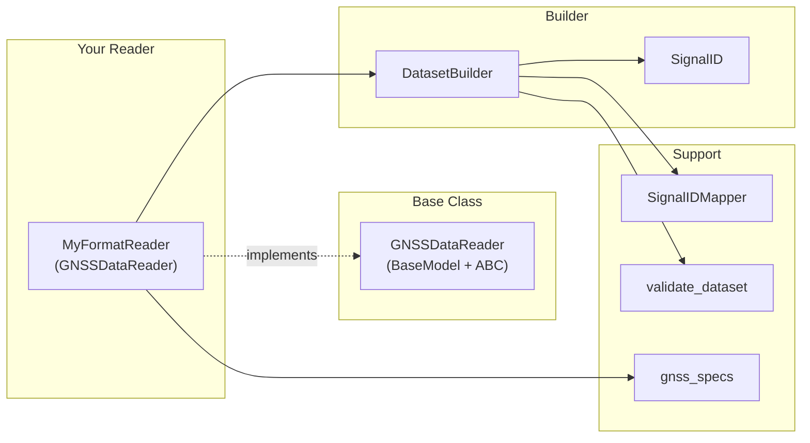

# Building a New Reader — Step-by-Step Guide

This guide walks you through building a new GNSS data format reader from scratch. It covers every aspect of the reader ecosystem: the abstract base class, Pydantic model configuration, signal identifiers, the DatasetBuilder, epoch iteration, file hashing, testing patterns, factory registration, and common pitfalls.

By the end you will have a fully functional, validated reader that integrates seamlessly with canvod-store, canvod-auxiliary, canvod-vod, and the rest of the canvodpy pipeline.

---

## Prerequisites

Before you start, make sure you understand:

- **xarray.Dataset** — the output format for all readers. Every reader produces a Dataset with dimensions `(epoch, sid)`.
- **Pydantic BaseModel** — used for runtime validation. `GNSSDataReader` is a BaseModel, so your reader is too.
- **Python ABCs** — `GNSSDataReader` uses `@abstractmethod` to enforce the contract. You must implement all abstract methods.

If you are unfamiliar with any of these, the [xarray docs](https://docs.xarray.dev/), [Pydantic docs](https://docs.pydantic.dev/), and [Python ABC docs](https://docs.python.org/3/library/abc.html) are good starting points.

---

## Architecture Overview



Your reader only needs to:

1. **Inherit** from `GNSSDataReader` (one parent — no need for separate `BaseModel`)
2. **Implement** abstract methods (`to_ds`, `iter_epochs`, `file_hash`, `start_time`, `end_time`, `systems`, `num_satellites`)
3. **Use `DatasetBuilder`** in your `to_ds()` method (recommended) — it handles all the tricky parts

---

## Step 1 — Create the Reader Class

### Minimal skeleton

```python
from collections.abc import Iterator
from datetime import datetime
from pathlib import Path

import xarray as xr
from pydantic import ConfigDict

from canvod.readers.base import GNSSDataReader
from canvod.readers.builder import DatasetBuilder
from canvod.readers.gnss_specs.utils import file_hash


class MyFormatReader(GNSSDataReader):
    """Reader for My Custom GNSS Format.

    Reads .myf files and produces (epoch × sid) xarray Datasets.
    """

    model_config = ConfigDict(frozen=True)
```

That's it for the class definition. Let's break down what you get for free:

### What `GNSSDataReader` provides

Since `GNSSDataReader` inherits from `pydantic.BaseModel` and `abc.ABC`, your reader automatically gets:

| Feature | Source | What it does |
|---------|--------|--------------|
| `fpath: Path` | `GNSSDataReader` | File path field — validated at construction |
| `_validate_fpath()` | `GNSSDataReader` | Checks `fpath.is_file()` — raises `FileNotFoundError` if missing |
| `model_config` | `GNSSDataReader` | `arbitrary_types_allowed=True` — needed for `pint.Quantity`, etc. |
| `_build_attrs()` | `GNSSDataReader` | Builds standard global attributes (Created, Software, Institution, File Hash) |
| `to_ds_and_auxiliary()` | `GNSSDataReader` | Default: calls `to_ds()` + returns empty aux dict |
| `num_epochs` | `GNSSDataReader` | Default: `sum(1 for _ in self.iter_epochs())` |
| `__repr__()` | `GNSSDataReader` | Returns `"MyFormatReader(file='filename.myf')"` |

### `model_config` options

The base class sets `arbitrary_types_allowed=True`. Your reader can extend or override `model_config`:

```python
# Immutable reader (recommended for most formats)
model_config = ConfigDict(frozen=True)

# Mutable reader with lazy cached properties
model_config = ConfigDict(frozen=False)

# Reader that ignores unknown constructor args
model_config = ConfigDict(extra="ignore")

# Combine options
model_config = ConfigDict(frozen=True, extra="forbid")
```

!!! tip "When to use `frozen=True` vs `frozen=False`"

    - Use `frozen=True` (default recommendation) when your reader has no mutable state
      after construction. This gives you thread safety, predictability, and cacheability.

    - Use `frozen=False` when you need `@cached_property` for lazy computation
      (e.g., SbfReader computes satellite geometry on first access). Note: Pydantic's
      `frozen=True` prevents `@cached_property` from working because it blocks
      attribute assignment.

### Adding reader-specific fields

If your format needs configuration, add Pydantic fields:

```python
class MyFormatReader(GNSSDataReader):
    model_config = ConfigDict(frozen=True)

    # Reader-specific configuration
    signal_type: str = "L1"     # default value
    skip_header: bool = False   # optional flag

    # Private attributes (not part of the model schema)
    _cache: dict = {}  # use PrivateAttr for mutable state
```

!!! warning "Do not redeclare `fpath`"

    The `fpath: Path` field is inherited from `GNSSDataReader`. If you redeclare it,
    you'll shadow the base class field and lose the file existence validator.

---

## Step 2 — Implement `file_hash`

The `file_hash` property is used by `canvod-store` (MyIcechunkStore) to prevent duplicate ingestion. It must be:

- **Deterministic** — same file always produces the same hash
- **Reproducible** — hash depends only on file content, not metadata

The simplest approach uses the provided `file_hash()` utility:

```python
from canvod.readers.gnss_specs.utils import file_hash as compute_hash

class MyFormatReader(GNSSDataReader):
    ...

    @property
    def file_hash(self) -> str:
        """16-character SHA-256 prefix of the raw file."""
        return compute_hash(self.fpath)
```

The utility reads the file in 8 KB chunks and returns the first 16 characters of the SHA-256 hex digest. This is sufficient for deduplication in practice.

!!! note "Custom hashing"

    If your format has a header section that changes between downloads (e.g., download
    timestamps), you may want to hash only the data section:

    ```python
    @property
    def file_hash(self) -> str:
        import hashlib
        h = hashlib.sha256()
        with self.fpath.open("rb") as f:
            f.seek(self._header_size)  # skip variable header
            for chunk in iter(lambda: f.read(8192), b""):
                h.update(chunk)
        return h.hexdigest()[:16]
    ```

---

## Step 3 — Implement Metadata Properties

These properties provide summary metadata about the file without reading all observations:

```python
from datetime import UTC, datetime

class MyFormatReader(GNSSDataReader):
    ...

    @property
    def start_time(self) -> datetime:
        """First observation timestamp in the file."""
        return self._parse_header().start_time

    @property
    def end_time(self) -> datetime:
        """Last observation timestamp in the file."""
        return self._parse_header().end_time

    @property
    def systems(self) -> list[str]:
        """GNSS systems present in the file.

        Returns system letters: 'G' (GPS), 'R' (GLONASS),
        'E' (Galileo), 'C' (BeiDou), 'J' (QZSS), 'S' (SBAS), 'I' (IRNSS).
        """
        return self._parse_header().systems  # e.g. ["G", "E", "R"]

    @property
    def num_satellites(self) -> int:
        """Total unique satellites across all epochs."""
        return self._parse_header().num_satellites
```

!!! tip "Lazy parsing with `@cached_property`"

    If parsing the header is expensive, use `@cached_property` (requires `frozen=False`):

    ```python
    from functools import cached_property

    class MyFormatReader(GNSSDataReader):
        model_config = ConfigDict(frozen=False)  # needed for cached_property

        @cached_property
        def _header(self):
            """Parse header once, cache result."""
            return self._parse_header_from_file()

        @property
        def start_time(self) -> datetime:
            return self._header.start_time
    ```

    If you use `frozen=True`, compute values in `__init__` or in `@model_validator(mode="after")` and store them in `PrivateAttr` fields.

### `num_epochs` — optional override

The base class provides a default `num_epochs` that counts epochs by iterating:

```python
@property
def num_epochs(self) -> int:
    return sum(1 for _ in self.iter_epochs())
```

This is O(n) — fine for small files, but slow for large ones. Override it if your format stores the epoch count in the header:

```python
@property
def num_epochs(self) -> int:
    return self._header.epoch_count  # O(1) from header
```

---

## Step 4 — Implement `iter_epochs()`

The epoch iterator provides memory-bounded streaming access to observations. It yields one epoch at a time, so even multi-GB files can be processed without loading everything into memory.

```python
from collections.abc import Iterator

class MyFormatReader(GNSSDataReader):
    ...

    def iter_epochs(self) -> Iterator[object]:
        """Lazily yield one epoch at a time.

        Each yielded object should contain:
        - timestamp: datetime
        - observations: list of (sv, band, code, values) tuples
        """
        with self.fpath.open("rb") as f:
            self._skip_header(f)
            while True:
                epoch = self._read_next_epoch(f)
                if epoch is None:
                    break
                yield epoch
```

### Epoch data structure

The exact structure of yielded epochs is up to you. Common patterns:

=== "Named tuple"

    ```python
    from typing import NamedTuple

    class MyEpoch(NamedTuple):
        timestamp: datetime
        observations: list[tuple[str, str, str, dict[str, float]]]
        # (sv, band, code, {"SNR": 42.0, "Pseudorange": 2e7})
    ```

=== "Pydantic model"

    ```python
    from pydantic import BaseModel

    class MyObservation(BaseModel):
        sv: str       # "G01"
        band: str     # "L1"
        code: str     # "C"
        snr: float
        pseudorange: float | None = None

    class MyEpoch(BaseModel):
        timestamp: datetime
        observations: list[MyObservation]
    ```

=== "Dataclass"

    ```python
    from dataclasses import dataclass

    @dataclass
    class MyEpoch:
        timestamp: datetime
        observations: list[tuple[str, str, str, dict[str, float]]]
    ```

!!! info "Why `Iterator[object]`?"

    The ABC uses `Iterator[object]` as the return type because different readers
    yield different epoch types. The type is intentionally loose at the interface
    level — your reader can yield any object.

---

## Step 5 — Implement `to_ds()` with DatasetBuilder

This is where everything comes together. The `DatasetBuilder` handles the tricky parts of Dataset construction — coordinate arrays, frequency resolution, dtype enforcement, metadata, and validation.

### Basic pattern

```python
from canvod.readers.builder import DatasetBuilder

class MyFormatReader(GNSSDataReader):
    ...

    def to_ds(
        self,
        keep_data_vars: list[str] | None = None,
        **kwargs,
    ) -> xr.Dataset:
        """Convert file to validated xarray.Dataset.

        Parameters
        ----------
        keep_data_vars : list of str, optional
            Variables to include. If None, includes all.
            Common: ["SNR"], ["SNR", "Phase", "Pseudorange"]
        """
        builder = DatasetBuilder(self)

        for epoch in self.iter_epochs():
            ei = builder.add_epoch(epoch.timestamp)

            for obs in epoch.observations:
                sig = builder.add_signal(
                    sv=obs.sv,
                    band=obs.band,
                    code=obs.code,
                )
                # Set each variable
                builder.set_value(ei, sig, "SNR", obs.snr)
                if obs.pseudorange is not None:
                    builder.set_value(ei, sig, "Pseudorange", obs.pseudorange)
                if obs.phase is not None:
                    builder.set_value(ei, sig, "Phase", obs.phase)

        return builder.build(
            keep_data_vars=keep_data_vars,
            extra_attrs={"Source Format": "My Custom Format"},
        )
```

### DatasetBuilder API reference

| Method | Returns | Description |
|--------|---------|-------------|
| `DatasetBuilder(reader)` | builder | Create a new builder |
| `add_epoch(timestamp)` | `int` | Register an epoch, returns its index |
| `add_signal(sv, band, code)` | `SignalID` | Register a signal (idempotent — same args = same ID) |
| `set_value(ei, sig, var, value)` | `None` | Set a value for epoch index + signal + variable |
| `build(keep_data_vars, extra_attrs)` | `xr.Dataset` | Build, validate, and return the Dataset |

### What `build()` does internally

1. **Sorts signals** alphabetically by SID string
2. **Resolves frequencies** from band names via `SignalIDMapper`
   - `freq_center` — center frequency in MHz (e.g., 1575.42 for GPS L1)
   - `freq_min` / `freq_max` — derived from center frequency ± bandwidth/2
3. **Constructs coordinate arrays** with correct dtypes:
   - `freq_*` coords are `float32` (required by `validate_dataset`)
   - `sv`, `system`, `band`, `code` are string arrays
   - `epoch` is `datetime64[ns]`
4. **Builds data variable arrays** — fills NaN for missing values
5. **Attaches CF-compliant metadata** from `COORDS_METADATA`, `SNR_METADATA`, etc.
6. **Adds global attributes** via `reader._build_attrs()` + optional `extra_attrs`
7. **Calls `validate_dataset()`** — raises `ValueError` listing ALL violations if any

### Supported data variables

The builder knows the dtype and metadata for these variables:

| Variable | Dtype | Description |
|----------|-------|-------------|
| `SNR` | `float32` | Signal-to-Noise Ratio (dB-Hz) |
| `CN0` | `float32` | Carrier-to-Noise density (dB-Hz) |
| `Pseudorange` | `float64` | Pseudorange measurement (meters) |
| `Phase` | `float64` | Carrier phase measurement (cycles) |
| `Doppler` | `float64` | Doppler shift (Hz) |
| `LLI` | `int8` | Loss of Lock Indicator |
| `SSI` | `int8` | Signal Strength Indicator |

You can use any of these names with `set_value()` and the builder will apply the correct dtype and metadata automatically.

### GLONASS FDMA aggregation

The builder supports GLONASS FDMA channel aggregation via the `aggregate_glonass_fdma` parameter:

```python
builder = DatasetBuilder(
    reader,
    aggregate_glonass_fdma=True,  # default
)
```

When enabled, GLONASS FDMA channels are aggregated into effective bands `G1*` and `G2*`, with:
- Center frequencies being the mean of the respective FDMA sub-bands
- Bandwidth stretching across all sub-bands including their respective bandwidths

---

## Step 6 — Implement `to_ds_and_auxiliary()` (Optional)

If your format embeds metadata beyond observations (satellite geometry, receiver quality metrics, DOP values), override `to_ds_and_auxiliary()` to collect both datasets in a single file scan:

```python
def to_ds_and_auxiliary(
    self,
    keep_data_vars: list[str] | None = None,
    **kwargs,
) -> tuple[xr.Dataset, dict[str, xr.Dataset]]:
    """Single-pass: obs dataset + metadata dataset.

    This avoids reading the file twice.
    """
    obs_builder = DatasetBuilder(self)
    meta_epochs = []
    meta_values = {}

    for epoch in self.iter_epochs():
        ei = obs_builder.add_epoch(epoch.timestamp)
        meta_epochs.append(epoch.timestamp)

        for obs in epoch.observations:
            sig = obs_builder.add_signal(
                sv=obs.sv, band=obs.band, code=obs.code
            )
            obs_builder.set_value(ei, sig, "SNR", obs.snr)

            # Collect metadata (e.g., elevation angle)
            if obs.elevation is not None:
                meta_values.setdefault("theta", {})[
                    (ei, str(sig))
                ] = obs.elevation

    obs_ds = obs_builder.build(keep_data_vars=keep_data_vars)

    # Build metadata dataset manually or with another builder
    meta_ds = self._build_metadata_ds(meta_epochs, meta_values)

    return obs_ds, {"my_format_meta": meta_ds}
```

The default implementation (inherited from `GNSSDataReader`) simply calls `to_ds()` and returns an empty dict — you only need to override if your format has auxiliary data.

---

## Step 7 — The `SignalID` Model

`SignalID` is the validated signal identifier used throughout the builder and reader ecosystem. Understanding it helps you debug issues with signal mapping.

### Structure

```python
from canvod.readers.base import SignalID

# Create from components
sig = SignalID(sv="G01", band="L1", code="C")

# Properties
sig.sv       # "G01"
sig.band     # "L1"
sig.code     # "C"
sig.system   # "G" (first letter of sv)
sig.sid      # "G01|L1|C" (the SID string)
str(sig)     # "G01|L1|C"

# Parse from SID string
sig2 = SignalID.from_string("E25|E5a|I")

# Frozen and hashable — can be used as dict keys
{sig: 42.0}
```

### SV validation

The `sv` field is validated against `SV_PATTERN` — a regex requiring:

- A system letter: `G` (GPS), `R` (GLONASS), `E` (Galileo), `C` (BeiDou), `J` (QZSS), `S` (SBAS), `I` (IRNSS)
- Followed by exactly 2 digits (PRN number): `01`–`99`

```python
# Valid SVs
SignalID(sv="G01", band="L1", code="C")  # GPS PRN 01
SignalID(sv="E25", band="E5a", code="I")  # Galileo E25
SignalID(sv="R12", band="G1", code="C")   # GLONASS R12

# Invalid SVs — raise ValueError at construction
SignalID(sv="X01", band="L1", code="C")   # 'X' not a valid system
SignalID(sv="G1",  band="L1", code="C")   # only 1 digit
SignalID(sv="GPS", band="L1", code="C")   # not a valid SV format
```

### Band and code naming

Band names must match what `SignalIDMapper` recognises for frequency resolution. Common band names:

| System | Bands |
|--------|-------|
| GPS | `L1`, `L2`, `L5` |
| Galileo | `E1`, `E5a`, `E5b`, `E5`, `E6` |
| GLONASS | `G1`, `G2`, `G3`, `G1a`, `G2a` |
| BeiDou | `B1I`, `B1C`, `B2a`, `B2b`, `B3I` |
| QZSS | `L1`, `L2`, `L5`, `L6` |

Code names are tracking codes (e.g., `C`, `P`, `W`, `I`, `Q`, `X`). The builder does not validate code names — they are stored as-is.

---

## Step 8 — Understanding the Output Dataset

Every reader must produce a Dataset that passes `validate_dataset()`. Here is the required structure:

### Dimensions

```
(epoch, sid)
```

- `epoch` — time dimension, one entry per observation epoch
- `sid` — signal identifier dimension, one entry per unique `SV|band|code` combination

### Coordinates

| Coordinate | Dtype | Indexed by | Description |
|------------|-------|------------|-------------|
| `epoch` | `datetime64[ns]` | `epoch` | Observation timestamps |
| `sid` | `object` (string) | `sid` | Signal ID strings (`"G01\|L1\|C"`) |
| `sv` | `object` (string) | `sid` | Satellite vehicle (`"G01"`) |
| `system` | `object` (string) | `sid` | System letter (`"G"`) |
| `band` | `object` (string) | `sid` | Band name (`"L1"`) |
| `code` | `object` (string) | `sid` | Tracking code (`"C"`) |
| `freq_center` | `float32` | `sid` | Center frequency (MHz) |
| `freq_min` | `float32` | `sid` | Lower band edge (MHz) |
| `freq_max` | `float32` | `sid` | Upper band edge (MHz) |

### Data variables

All data variables must have dimensions `(epoch, sid)`.

The default required variable is `SNR`. If your format provides additional observables, include them:

```python
# The keep_data_vars parameter lets users select which to include
ds = reader.to_ds(keep_data_vars=["SNR"])               # just SNR
ds = reader.to_ds(keep_data_vars=["SNR", "Phase"])       # SNR + Phase
ds = reader.to_ds()                                       # all available
```

### Required global attributes

| Attribute | Description | Set by |
|-----------|-------------|--------|
| `Created` | ISO 8601 timestamp | `_build_attrs()` |
| `Software` | Package name + version | `_build_attrs()` |
| `Institution` | From config | `_build_attrs()` |
| `File Hash` | SHA-256 prefix | `_build_attrs()` |

The `_build_attrs()` method (inherited from `GNSSDataReader`) sets all of these automatically. You can add format-specific attributes via `extra_attrs` in `builder.build()`.

---

## Step 9 — Testing Your Reader

Thorough testing is essential. Here are the patterns to follow.

### Test file structure

```
packages/canvod-readers/tests/
├── test_my_format_reader.py      # your tests
├── test_data/
│   └── sample.myf                # small test file
└── conftest.py                   # shared fixtures
```

### Unit tests

```python
import pytest
import numpy as np
from pathlib import Path
from canvod.readers.base import validate_dataset

from my_package import MyFormatReader


@pytest.fixture
def sample_file(tmp_path: Path) -> Path:
    """Create a minimal test file."""
    f = tmp_path / "sample.myf"
    f.write_bytes(b"... minimal valid file content ...")
    return f


@pytest.fixture
def reader(sample_file: Path) -> MyFormatReader:
    return MyFormatReader(fpath=sample_file)


class TestMyFormatReader:
    """Tests for MyFormatReader."""

    # --- Construction ---

    def test_constructor_validates_file(self, sample_file):
        """Reader can be constructed with a valid file."""
        reader = MyFormatReader(fpath=sample_file)
        assert reader.fpath == sample_file

    def test_constructor_rejects_missing_file(self, tmp_path):
        """Reader raises FileNotFoundError for missing files."""
        with pytest.raises(FileNotFoundError):
            MyFormatReader(fpath=tmp_path / "nonexistent.myf")

    # --- File hash ---

    def test_file_hash_deterministic(self, reader):
        """Same file always produces the same hash."""
        assert reader.file_hash == reader.file_hash

    def test_file_hash_length(self, reader):
        """Hash is 16 characters."""
        assert len(reader.file_hash) == 16

    # --- Dataset structure ---

    def test_dataset_dimensions(self, reader):
        """Dataset has (epoch, sid) dimensions."""
        ds = reader.to_ds()
        assert "epoch" in ds.dims
        assert "sid" in ds.dims

    def test_dataset_has_snr(self, reader):
        """Dataset contains SNR variable."""
        ds = reader.to_ds()
        assert "SNR" in ds.data_vars

    def test_dataset_variable_dims(self, reader):
        """All variables have (epoch, sid) dimensions."""
        ds = reader.to_ds()
        for var in ds.data_vars:
            assert ds[var].dims == ("epoch", "sid")

    def test_freq_coords_are_float32(self, reader):
        """Frequency coordinates must be float32."""
        ds = reader.to_ds()
        assert ds["freq_center"].dtype == np.float32
        assert ds["freq_min"].dtype == np.float32
        assert ds["freq_max"].dtype == np.float32

    def test_file_hash_in_attrs(self, reader):
        """File Hash attribute matches reader.file_hash."""
        ds = reader.to_ds()
        assert ds.attrs["File Hash"] == reader.file_hash

    def test_required_attrs_present(self, reader):
        """All required attributes are present."""
        ds = reader.to_ds()
        for attr in ["Created", "Software", "Institution", "File Hash"]:
            assert attr in ds.attrs

    # --- Validation round-trip ---

    def test_validate_dataset_passes(self, reader):
        """validate_dataset() does not raise."""
        ds = reader.to_ds()
        validate_dataset(ds)  # should not raise

    # --- keep_data_vars ---

    def test_keep_data_vars_filters(self, reader):
        """keep_data_vars limits output variables."""
        ds = reader.to_ds(keep_data_vars=["SNR"])
        assert "SNR" in ds.data_vars
        # Other variables should be absent

    # --- Metadata properties ---

    def test_start_time(self, reader):
        """start_time returns a datetime."""
        assert isinstance(reader.start_time, datetime)

    def test_end_time_after_start(self, reader):
        """end_time is after start_time."""
        assert reader.end_time >= reader.start_time

    def test_systems_are_valid(self, reader):
        """systems returns valid system letters."""
        valid = {"G", "R", "E", "C", "J", "S", "I"}
        assert all(s in valid for s in reader.systems)

    def test_num_satellites_positive(self, reader):
        """num_satellites is positive."""
        assert reader.num_satellites > 0

    # --- Epoch iteration ---

    def test_iter_epochs_yields(self, reader):
        """iter_epochs yields at least one epoch."""
        epochs = list(reader.iter_epochs())
        assert len(epochs) > 0
```

### Integration tests

```python
@pytest.mark.integration
def test_full_pipeline(real_test_file):
    """End-to-end: read → filter → verify."""
    reader = MyFormatReader(fpath=real_test_file)
    ds = reader.to_ds(keep_data_vars=["SNR"])

    # Filter GPS only
    gps = ds.where(ds.system == "G", drop=True)
    assert len(gps.sid) > 0

    # Sanity-check values
    assert float(gps.SNR.mean()) > 0

    # SID format check
    for sid in ds.sid.values:
        parts = str(sid).split("|")
        assert len(parts) == 3, f"Invalid SID format: {sid}"
```

### Using `ds.sizes` not `ds.dims` for lengths

!!! warning "FutureWarning"

    xarray has deprecated using `ds.dims["epoch"]` to get dimension lengths.
    Use `ds.sizes["epoch"]` instead:

    ```python
    # WRONG — triggers FutureWarning
    n_epochs = ds.dims["epoch"]

    # CORRECT
    n_epochs = ds.sizes["epoch"]
    ```

---

## Step 10 — Register with ReaderFactory

The `ReaderFactory` allows automatic format detection and reader instantiation:

```python
from canvod.readers.base import ReaderFactory

# Register your reader
ReaderFactory.register("my_format", MyFormatReader)

# Now it can be used via the factory
reader = ReaderFactory.create("data.myf")
ds = reader.to_ds()
```

If you want automatic format detection (not just name-based), you'll also need to update `ReaderFactory._detect_format()` to recognise your format's magic bytes or header pattern:

```python
# In canvod/readers/base.py → ReaderFactory._detect_format()
@staticmethod
def _detect_format(fpath: Path) -> str:
    with fpath.open("rb") as f:
        magic = f.read(8)

    if magic.startswith(b"MYFORMAT"):
        return "my_format"

    # ... existing RINEX detection ...
```

---

## Step 11 — Package Structure

For a reader that ships as part of canvod-readers:

```
packages/canvod-readers/
├── src/canvod/readers/
│   ├── __init__.py           # add your reader to exports
│   ├── base.py               # GNSSDataReader, SignalID, etc.
│   ├── builder.py            # DatasetBuilder
│   ├── my_format/            # your reader package
│   │   ├── __init__.py       # export MyFormatReader
│   │   ├── reader.py         # main reader class
│   │   ├── models.py         # Pydantic models for parsing (optional)
│   │   └── _parsing.py       # internal parsing helpers
│   ├── rinex/                # existing RINEX reader
│   └── sbf/                  # existing SBF reader
└── tests/
    ├── test_my_format_reader.py
    └── test_data/
        └── sample.myf
```

Update `__init__.py` to export your reader:

```python
# In canvod/readers/__init__.py
from canvod.readers.my_format import MyFormatReader

__all__ = [
    ...
    "MyFormatReader",
]
```

---

## Complete Example

Here is a complete, minimal reader implementation:

```python
"""Reader for hypothetical .gnsd format (GNSS Simple Data)."""

from collections.abc import Iterator
from datetime import UTC, datetime
from typing import NamedTuple

import xarray as xr
from pydantic import ConfigDict

from canvod.readers.base import GNSSDataReader
from canvod.readers.builder import DatasetBuilder
from canvod.readers.gnss_specs.utils import file_hash as compute_hash


class GnsdObservation(NamedTuple):
    sv: str
    band: str
    code: str
    snr: float


class GnsdEpoch(NamedTuple):
    timestamp: datetime
    observations: list[GnsdObservation]


class GnsdReader(GNSSDataReader):
    """Reader for .gnsd files.

    File format (text, line-based):
        GNSD 1.0
        EPOCH 2025-01-01T00:00:00Z
        G01 L1 C 42.5
        G02 L1 C 38.2
        E01 E1 C 40.1
        EPOCH 2025-01-01T00:00:30Z
        G01 L1 C 43.0
        ...
        END
    """

    model_config = ConfigDict(frozen=True)

    @property
    def file_hash(self) -> str:
        return compute_hash(self.fpath)

    def iter_epochs(self) -> Iterator[GnsdEpoch]:
        current_ts = None
        current_obs: list[GnsdObservation] = []

        with self.fpath.open() as f:
            next(f)  # skip header line "GNSD 1.0"

            for line in f:
                line = line.strip()

                if line == "END":
                    if current_ts is not None:
                        yield GnsdEpoch(current_ts, current_obs)
                    break

                if line.startswith("EPOCH"):
                    # Yield previous epoch
                    if current_ts is not None:
                        yield GnsdEpoch(current_ts, current_obs)

                    current_ts = datetime.fromisoformat(
                        line.split()[1].replace("Z", "+00:00")
                    )
                    current_obs = []
                else:
                    parts = line.split()
                    current_obs.append(
                        GnsdObservation(
                            sv=parts[0],
                            band=parts[1],
                            code=parts[2],
                            snr=float(parts[3]),
                        )
                    )

    def to_ds(
        self,
        keep_data_vars: list[str] | None = None,
        **kwargs,
    ) -> xr.Dataset:
        builder = DatasetBuilder(self)

        for epoch in self.iter_epochs():
            ei = builder.add_epoch(epoch.timestamp)
            for obs in epoch.observations:
                sig = builder.add_signal(
                    sv=obs.sv, band=obs.band, code=obs.code
                )
                builder.set_value(ei, sig, "SNR", obs.snr)

        return builder.build(
            keep_data_vars=keep_data_vars,
            extra_attrs={"Source Format": "GNSD 1.0"},
        )

    @property
    def start_time(self) -> datetime:
        for epoch in self.iter_epochs():
            return epoch.timestamp
        msg = "No epochs in file"
        raise ValueError(msg)

    @property
    def end_time(self) -> datetime:
        last = None
        for epoch in self.iter_epochs():
            last = epoch.timestamp
        if last is None:
            msg = "No epochs in file"
            raise ValueError(msg)
        return last

    @property
    def systems(self) -> list[str]:
        systems = set()
        for epoch in self.iter_epochs():
            for obs in epoch.observations:
                systems.add(obs.sv[0])
        return sorted(systems)

    @property
    def num_satellites(self) -> int:
        svs = set()
        for epoch in self.iter_epochs():
            for obs in epoch.observations:
                svs.add(obs.sv)
        return len(svs)
```

---

## Common Pitfalls

### 1. Wrong frequency coordinate dtype

```python
# WRONG — float64 fails validate_dataset()
freq_center = np.array([1575.42], dtype=np.float64)

# CORRECT — use DatasetBuilder, which handles this automatically
builder.add_signal(sv="G01", band="L1", code="C")
# freq_center will be float32 in the output
```

### 2. Skipping validation

```python
# WRONG — no validation, may produce invalid datasets
def to_ds(self, **kwargs) -> xr.Dataset:
    ds = self._build_dataset_manually()
    return ds  # ← nobody checks this

# CORRECT — DatasetBuilder.build() validates automatically
def to_ds(self, **kwargs) -> xr.Dataset:
    builder = DatasetBuilder(self)
    # ... populate ...
    return builder.build()  # ← validates before returning
```

### 3. Wrong dimension names

```python
# WRONG — "time" and "signal" are not the contract names
data_vars = {"SNR": (("time", "signal"), data)}

# CORRECT — use (epoch, sid)
data_vars = {"SNR": (("epoch", "sid"), data)}

# BEST — use DatasetBuilder, which always uses the right names
```

### 4. Redeclaring `fpath`

```python
# WRONG — shadows base class field, loses file validation
class MyReader(GNSSDataReader):
    fpath: Path  # ← DON'T DO THIS

# CORRECT — fpath is inherited
class MyReader(GNSSDataReader):
    model_config = ConfigDict(frozen=True)
    # fpath comes from GNSSDataReader
```

### 5. Double inheritance with BaseModel

```python
# WRONG — redundant, causes MRO complexity
class MyReader(GNSSDataReader, BaseModel):
    ...

# CORRECT — GNSSDataReader IS a BaseModel
class MyReader(GNSSDataReader):
    ...
```

### 6. Forgetting `arbitrary_types_allowed`

```python
# WRONG — if you need pint.Quantity in your reader
class MyReader(GNSSDataReader):
    model_config = ConfigDict(frozen=True, arbitrary_types_allowed=False)
    some_quantity: pint.Quantity  # ← will fail validation

# CORRECT — base class already provides arbitrary_types_allowed=True
class MyReader(GNSSDataReader):
    model_config = ConfigDict(frozen=True)
    # arbitrary_types_allowed is inherited from GNSSDataReader
```

### 7. Using `ds.dims` for lengths

```python
# WRONG — FutureWarning in xarray
assert ds.dims["epoch"] == 100

# CORRECT
assert ds.sizes["epoch"] == 100
```

### 8. Non-UTC timestamps

```python
# WRONG — naive or local time
from datetime import datetime
builder.add_epoch(datetime(2025, 1, 1))  # ← no timezone

# CORRECT — always use UTC
from datetime import UTC, datetime
builder.add_epoch(datetime(2025, 1, 1, tzinfo=UTC))
```

---

## Reference: Contract Constants

These are importable from `canvod.readers.base` and are the **single source of truth**:

```python
from canvod.readers.base import (
    REQUIRED_DIMS,          # ("epoch", "sid")
    REQUIRED_COORDS,        # {name: dtype, ...}
    REQUIRED_ATTRS,         # {"Created", "Software", "Institution", "File Hash"}
    DEFAULT_REQUIRED_VARS,  # ["SNR"]
)
```

---

## Reference: Key Imports

```python
# Base class and validation
from canvod.readers.base import GNSSDataReader, SignalID, validate_dataset

# Dataset construction
from canvod.readers.builder import DatasetBuilder

# Factory
from canvod.readers.base import ReaderFactory

# Signal mapping
from canvod.readers.gnss_specs.signals import SignalIDMapper

# File hashing
from canvod.readers.gnss_specs.utils import file_hash

# Metadata templates
from canvod.readers.gnss_specs.metadata import (
    COORDS_METADATA,
    SNR_METADATA,
    CN0_METADATA,
    OBSERVABLES_METADATA,
    DTYPES,
)

# Constellation definitions
from canvod.readers.gnss_specs.constellations import (
    GPS, GALILEO, GLONASS, BEIDOU, QZSS, SBAS, IRNSS,
    SV_PATTERN,
)
```

---

## Further Reading

- [Reader Architecture](architecture.md) — layered architecture, design principles, component interactions
- [Extending Readers](extending.md) — quick-reference checklist and validation requirements
- [RINEX Format](rinex-format.md) — RINEX v3.04 specifics
- [SBF Reader](sbf.md) — Septentrio Binary Format specifics
- [API Reference](../../api/canvod-readers.md) — full API documentation
