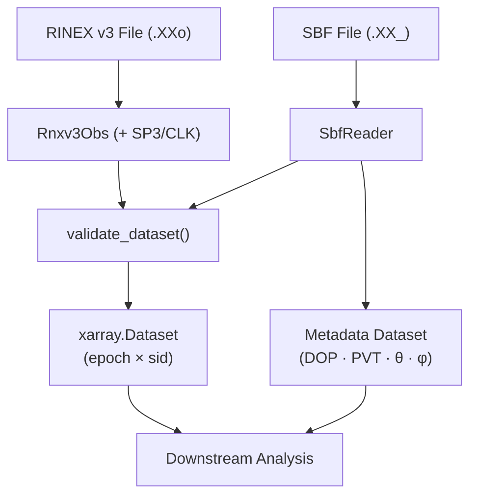

# canvod-readers

## Purpose

The `canvod-readers` package provides validated parsers for GNSS observation data. It transforms raw receiver files into analysis-ready xarray Datasets, serving as the data ingestion layer for GNSS Transmissometry (GNSS-T) analysis.

<div class="grid cards" markdown>

-   :fontawesome-solid-file-lines: &nbsp; **RINEX v3.04 — `Rnxv3Obs`**

    ---

    Text-based, all-GNSS standard format.
    Satellite geometry requires external SP3 + CLK precise ephemerides.

    [:octicons-arrow-right-24: RINEX format](rinex-format.md)

-   :fontawesome-solid-satellite-dish: &nbsp; **SBF Binary — `SbfReader`**

    ---

    Septentrio binary telemetry. Satellite geometry, PVT quality, DOP,
    and receiver health are **embedded** — no ephemeris download needed.

    [:octicons-arrow-right-24: SBF reader](sbf.md)

</div>

---

## Supported Formats at a Glance

| Feature | `Rnxv3Obs` | `SbfReader` |
| ------- | ---------- | ----------- |
| Format | Plain text | Binary |
| Extension | `.rnx`, `.XXo` | `.XX_`, `*.sbf` |
| Satellite geometry (θ, φ) | SP3 download | **Embedded** |
| Extra metadata | Header only | PVT · DOP · quality |
| `to_ds()` | ✓ | ✓ |
| `iter_epochs()` | ✓ | ✓ |
| `to_metadata_ds()` | — | ✓ |
| `to_ds_and_auxiliary()` | `{}` aux | `{"sbf_obs": meta_ds}` |

!!! tip "Drop-in replacement"

    Both readers produce identical `(epoch × sid)` xarray Datasets that pass
    `validate_dataset()`. Downstream code is completely reader-agnostic.

---

## Design

### Data flow



### Contract-Based Design

All readers implement the `GNSSDataReader` base class — a Pydantic `BaseModel` + ABC that provides file path validation, model configuration, and a consistent interface:

```python
from pydantic import BaseModel, ConfigDict, field_validator
from abc import ABC, abstractmethod
import xarray as xr

class GNSSDataReader(BaseModel, ABC):
    """Base class for all GNSS data format readers."""

    model_config = ConfigDict(arbitrary_types_allowed=True)
    fpath: Path  # Validated at construction time

    @abstractmethod
    def to_ds(self, **kwargs) -> xr.Dataset:
        """Convert to xarray.Dataset (epoch × sid)."""

    @abstractmethod
    def iter_epochs(self):
        """Iterate through epochs."""

    @property
    @abstractmethod
    def file_hash(self) -> str:
        """SHA-256 hash for deduplication."""

    def to_ds_and_auxiliary(
        self, **kwargs
    ) -> tuple[xr.Dataset, dict[str, xr.Dataset]]:
        """Single-pass scan: obs dataset + any auxiliary datasets.

        Default returns empty aux dict.
        SbfReader overrides for one-pass binary decode.
        """
        return self.to_ds(**kwargs), {}
```

Subclasses only need to inherit from `GNSSDataReader` — no separate `BaseModel` import, no `fpath` field, no file validation boilerplate.

[:octicons-arrow-right-24: Full architecture](architecture.md)

---

## Usage Examples

=== "RINEX — VOD pipeline"

    ```python
    from canvod.readers import Rnxv3Obs

    reader = Rnxv3Obs(fpath="station.25o")
    ds = reader.to_ds(keep_data_vars=["SNR"])

    # Filter L-band signals
    l_band = ds.where(ds.band.isin(["L1", "L2", "L5"]), drop=True)
    ```

=== "SBF — quick-look (no downloads)"

    ```python
    from canvod.readers.sbf import SbfReader

    reader = SbfReader(fpath="rref001a00.25_")
    obs_ds, aux = reader.to_ds_and_auxiliary(keep_data_vars=["SNR"])
    meta_ds = aux["sbf_obs"]

    # Zenith angle filter: elevation ≥ 20°
    snr_filtered = obs_ds["SNR"].where(meta_ds["theta"] <= 70)
    ```

=== "Multi-constellation analysis"

    ```python
    ds = reader.to_ds()

    for system in ["G", "R", "E", "C"]:
        sys_ds = ds.where(ds.system == system, drop=True)
        mean_snr = sys_ds.SNR.mean(dim=["epoch", "sid"])
        print(f"{system}: {mean_snr:.2f} dB")
    ```

=== "ReaderFactory — format registry"

    ```python
    from canvodpy import ReaderFactory

    # By name (works for all registered readers)
    reader = ReaderFactory.create("rinex3", fpath="station.25o")

    # Auto-detect RINEX v2/v3 from file header
    reader = ReaderFactory.create_from_file("station.25o")

    # Both produce identical (epoch × sid) datasets
    ds = reader.to_ds(keep_data_vars=["SNR"])
    ```

=== "Time-series concat"

    ```python
    import xarray as xr
    from pathlib import Path

    datasets = [
        Rnxv3Obs(fpath=f).to_ds(keep_data_vars=["SNR"])
        for f in sorted(Path("/data/").glob("*.25o"))
    ]

    time_series = xr.concat(datasets, dim="epoch")
    ```

---

## Key Components

<div class="grid cards" markdown>

-   :fontawesome-solid-fingerprint: &nbsp; **`SignalID` — Validated Signal Identifiers**

    ---

    Pydantic model for signal identifiers (`SV|band|code`).
    Validates the SV against known GNSS systems at creation time.
    Frozen, hashable, and used throughout the builder and readers.

    ```python
    from canvod.readers import SignalID

    sig = SignalID(sv="G01", band="L1", code="C")
    sig.sid     # → "G01|L1|C"
    sig.system  # → "G"
    ```

-   :fontawesome-solid-hammer: &nbsp; **`DatasetBuilder` — Guided Dataset Construction**

    ---

    Handles coordinate assembly, frequency resolution, dtype enforcement,
    and validation. Readers use `add_epoch()` → `add_signal()` → `set_value()`
    → `build()` instead of manual numpy/xarray assembly.

    ```python
    from canvod.readers.builder import DatasetBuilder

    builder = DatasetBuilder(reader)
    ei = builder.add_epoch(timestamp)
    sig = builder.add_signal(sv="G01", band="L1", code="C")
    builder.set_value(ei, sig, "SNR", 42.0)
    ds = builder.build()  # validated Dataset
    ```

-   :fontawesome-solid-earth-europe: &nbsp; **GNSS Specifications**

    ---

    `gnss_specs` provides constellation definitions for GPS, GALILEO,
    GLONASS, BeiDou, QZSS, and SBAS including band mappings and
    centre frequencies.

    ```python
    from canvod.readers.gnss_specs.constellations import GPS
    gps = GPS(use_wiki=False)  # static SVs, no network
    gps.BANDS  # {'1': 'L1', '2': 'L2', '5': 'L5'}
    ```

-   :fontawesome-solid-id-badge: &nbsp; **Signal ID Mapper**

    ---

    `SignalIDMapper` provides frequency, bandwidth, and overlap-group
    lookups for canonical `SV|Band|Code` signal IDs.  SIDs are
    constructed directly from header obs codes in the fast-path reader.

    ```python
    mapper = SignalIDMapper()
    freq = mapper.get_band_frequency("L1")   # → 1575.42
    bw   = mapper.get_band_bandwidth("L1")   # → 30.69
    ```

-   :fontawesome-solid-circle-check: &nbsp; **`validate_dataset()`**

    ---

    Every dataset produced by any reader must pass structural validation
    before it is returned. Checks dimensions, coordinate dtypes, required
    variables, and global attributes.

    ```python
    from canvod.readers.base import validate_dataset
    validate_dataset(ds)  # raises ValueError listing ALL violations
    ```

</div>

---

## Performance

### Single-Pass Parser

`Rnxv3Obs` uses a single-pass parser (`_create_dataset_single_pass`) that pre-computes the full Signal ID (SID) space from the RINEX header and fills pre-allocated NumPy arrays in one pass over the file. This avoids the overhead of:

- **Per-observation object allocation** — inline string parsing (`_parse_obs_fast`) replaces Pydantic model instantiation
- **Repeated signal ID lookups** — a pre-built lookup table maps `(SV, obs_code)` → array index directly
- **Redundant header re-parsing** — SIDs are derived once from header metadata via `_precompute_sids_from_header()`

### Tips

!!! tip "Memory"

    Use `keep_data_vars=["SNR"]` to load only what you need.
    Full RINEX with phase + Doppler uses ~4× more memory.

!!! tip "Batch processing"

    For many files, the orchestrator uses **Dask Distributed** with a
    `LocalCluster` for parallel RINEX processing (falls back to
    `ProcessPoolExecutor` if Dask is unavailable).  See
    `canvodpy.orchestrator` for batch pipeline details.

!!! tip "Storage"

    After processing, write to Icechunk via `canvod-store` for
    compressed, versioned storage with O(1) epoch lookups.
