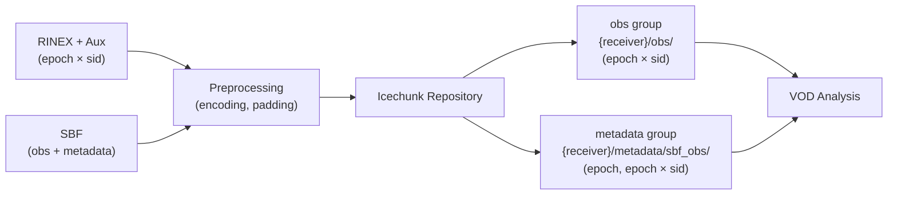

# canvod-store

## Purpose

The `canvod-store` package provides versioned storage management for GNSS vegetation optical depth data using **Icechunk** — a cloud-native transactional format for multidimensional arrays built on Zarr v3.

<div class="grid cards" markdown>

-   :fontawesome-solid-code-branch: &nbsp; **Git-like versioning**

    ---

    Every write produces an Icechunk snapshot with a hash-addressable ID.
    Roll back to any earlier state, audit every append, and reproduce any
    result published from the store.

-   :fontawesome-solid-cloud: &nbsp; **Cloud-native**

    ---

    S3-compatible backends (AWS, MinIO, Cloudflare R2).
    Local filesystem for development. Zero code change to switch.

-   :fontawesome-solid-gauge-high: &nbsp; **Chunked time-series access**

    ---

    Default chunks: `epoch: 34560, sid: -1` — one month of 1 Hz data per chunk.
    Zstd compression, O(1) epoch-range reads.

-   :fontawesome-solid-layer-group: &nbsp; **Generic metadata API**

    ---

    Any reader that returns auxiliary datasets via `to_ds_and_auxiliary()`
    can store them under `{receiver}/metadata/{name}` — fully reader-agnostic.

</div>

---

## Architecture



---

## Core Components

=== "Storage Manager"

    ```python
    from canvod.store import MyIcechunkStore

    store = MyIcechunkStore(store_path, strategy="append")
    store.write(dataset)
    ```

=== "Reader Interface"

    ```python
    from canvod.store import IcechunkDataReader

    reader = IcechunkDataReader(store_path)
    ds = reader.read(time_range=("2024-01-01", "2024-12-31"))
    ```

=== "Site Interface"

    ```python
    from canvodpy import Site

    site = Site("Rosalia")
    site.rinex_store.list_groups()          # ["canopy_01", "reference_01"]
    site.rinex_store.get_group_info("canopy_01")
    ```

---

## Generic Metadata Dataset API

Readers that produce auxiliary data (currently `SbfReader`) store it alongside
observations in a dedicated Zarr group: `{receiver_name}/metadata/{name}`.

!!! tip "Reader-agnostic"

    Any reader that returns a named dataset from `to_ds_and_auxiliary()` can be
    stored and retrieved with these methods — no hardcoded reader logic in the store.

=== "Writing"

    ```python
    # Generic write — works for any reader-produced metadata
    snapshot = site.rinex_store.write_metadata_dataset(
        meta_ds,          # xr.Dataset
        "canopy_02",      # receiver / group name
        "sbf_obs",        # dataset name (key from aux_dict)
    )

    # SBF convenience alias
    snapshot = site.rinex_store.write_sbf_metadata(meta_ds, "canopy_02")
    ```

=== "Reading"

    ```python
    # Generic read
    meta_ds = site.rinex_store.read_metadata_dataset(
        "canopy_02", "sbf_obs",
        chunks={"epoch": 34560, "sid": -1},
    )

    # SBF convenience alias
    meta_ds = site.rinex_store.read_sbf_metadata("canopy_02")
    ```

=== "Introspection"

    ```python
    exists = site.rinex_store.metadata_dataset_exists("canopy_02", "sbf_obs")

    info = site.rinex_store.get_metadata_dataset_info("canopy_02", "sbf_obs")
    # {
    #     "group_name":   "canopy_02",
    #     "store_path":   "canopy_02/metadata/sbf_obs",
    #     "dimensions":   {"epoch": 86400, "sid": 72},
    #     "variables":    ["pdop", "hdop", "theta", "phi", ...],
    #     "temporal_info": {"start": ..., "end": ..., "resolution": ...},
    # }
    ```

---

## Storage Layout

```
{receiver_name}/
├── obs/                        # Observations (epoch × sid)
│   ├── SNR
│   ├── Pseudorange
│   └── ...
└── metadata/
    └── sbf_obs/                # SBF metadata
        ├── pdop                # epoch scalar
        ├── hdop
        ├── vdop
        ├── pvt_mode
        ├── n_sv
        ├── h_accuracy
        ├── v_accuracy
        ├── cpu_load
        ├── temperature
        ├── rx_error            # bitmask (see SBF Reader docs)
        ├── theta               # epoch × sid: zenith angle
        ├── phi                 # epoch × sid: geographic azimuth
        ├── rise_set            # epoch × sid
        ├── mp_correction_m     # epoch × sid
        ├── code_var            # epoch × sid
        └── carrier_var         # epoch × sid
```

---

## Data Flow

1. **Ingest** — Raw GNSS data (RINEX + SP3/CLK, or SBF) via `to_ds_and_auxiliary()`
2. **Preprocess** — Normalise encodings, pad to global SID, strip fill values
3. **Store observations** — Append to `{group}/obs/` with hash deduplication
4. **Store metadata** — Write auxiliary datasets to `{group}/metadata/{name}/`
5. **Query** — Retrieve by time range, signal, or group name
6. **Analyse** — VOD calculation using obs + metadata geometry

---

## Storage Format

| Property | Value |
| -------- | ----- |
| Backend format | Icechunk (Zarr v3) |
| Default chunks | `epoch: 34560`, `sid: -1` |
| Compression | Zstd level 5 |
| Cloud backends | S3, MinIO, R2, local filesystem |
| Versioning | Git-like snapshots, hash-addressable |
| Deduplication | SHA-256 file hash per RINEX/SBF file |

[:octicons-arrow-right-24: Icechunk storage details](icechunk.md)
